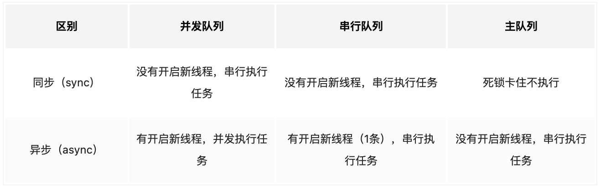
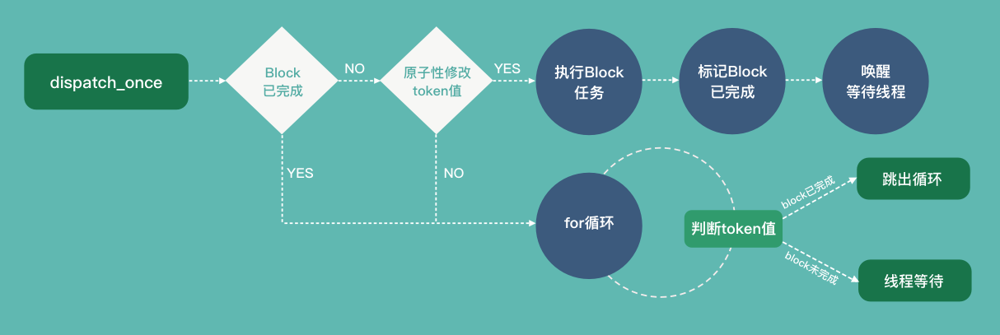
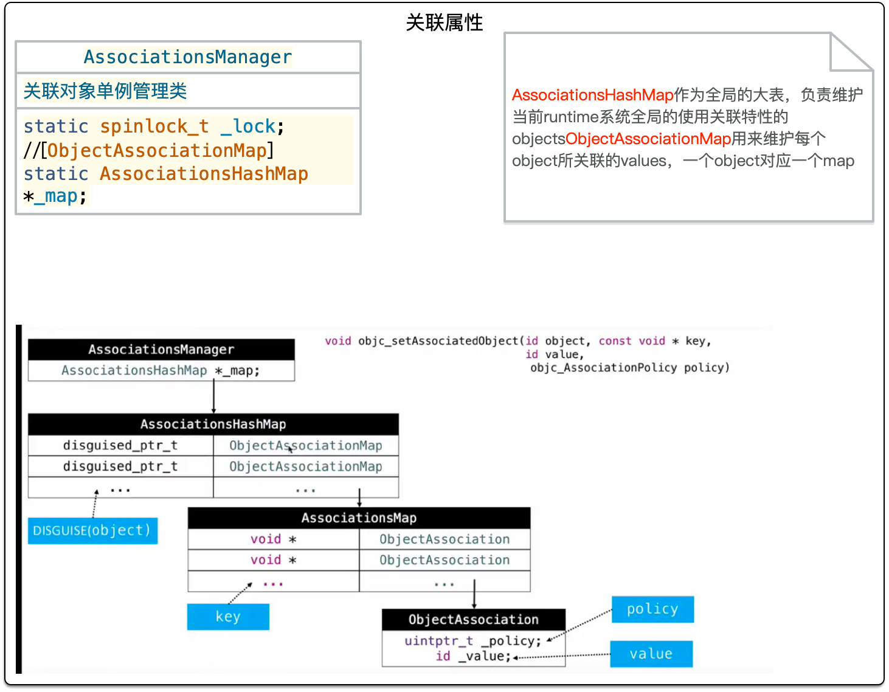

# 面试题库

## 开源项目链接

* [GUN](https://github.com/gnustep/libs-base)
* [runtime](https://github.com/RetVal/objc-runtime)
* [apple官方](https://opensource.apple.com/tarballs/objc4/)
* [iOS 底层原理](https://blog.csdn.net/lin1109221208/article/details/108441586)
* [网络协议八股文](https://blog.csdn.net/qq_43255017/article/details/104483015)
* [Swift文档](https://swiftgg.gitbook.io/swift/swift-jiao-cheng/01_the_basics)

## OC基础

### 语法

1. 我们说的OC是动态运行时语言是什么意思？

   * 动态指将数据类型的确定从编译时，推迟到运行时
   * OC的三个特性
     * 动态类型：id类型，在运行时程序才会根据语境来确定到底是什么类型
     * 动态绑定：`@selector/SEL`，OC可以先跳过编译，到运行的时候才动态地添加函数调用，在运行时才决定要调 用什么方法，需要传什么参数进去。
     * 动态加载：根据需求加载所需要的资源
2. Objective - C 是否支持方法重载(overloading)？

   * 不支持严格的方法重载，不支持函数名相同，参数类型不同的重载，支持函数名相同，第二个参数标签不同的的重载（其实就是不支持）
3. @synthesize作用，实际使用场景

   * 作用:自动生成set/get方法和对应成员变量
   * 用途：
     * 给成员变量重命名
     * `protocol`中声明属性后，准守协议类中需要使用`@synthesize`进行声明，来生成对应的成员变量

       ```objectivec

       @protocol MyProtocol <NSObject>
       @property (nonatomic,strong) NSString *myImage;
       @end

       @interface ViewController : UIViewController<MyProtocol>
       @end
       @implementation ViewController
       @synthesize myImage = _myImage;
       - (void)viewDidLoad {
           [super viewDidLoad];
           self.myImage = @"my string";
           NSLog(@"%@,%@",_myImage,self.myImage);
       @end

       ```
4. `@dynamic`的作用

   * 告诉编译器属性的get和set方法由开发者自己实现，避免编译器实现后覆盖了开发者的实现

     ```objectivec

     @interface MyGCD ()
     {
         NSString *_str;
     }
     @end

     @implementation MyGCD
     @dynamic str;//手动同时重写get、set方法时声明

     - (void)setStr:(NSString *)str {
         if (_str != str) {
             _str = str
         };
     }

     - (NSString *)str {
         return _str;
     }

     @end
     ```
5. 说说对`property` 的理解

   * `property`是声明属性的关键字，可以控制属性的内存管理方式、原子性、是否可为null（nonull、nulltable等关键字为iOS9已上有）及读写权限，使用此关键字声明时，会默认生成get和set方法，如不想生成get、set方法，可以使用@synthesize在 `@implementation`实现中进行声明
6. 你是否接触过OC中的反射机制？简单聊一下概念和使用？

   * 反射：动态的运行状态下我们可以构造任意一个类，然后我们通过这个类知道这个类的所有属性和方法，并且如果我们创建一个对象，我们也可以通过对象找到这个类的任意一个方法，这就是反射机制
   * 相关方法
     ```objectivec
     NSClassFormString
     NSStringFormClass
     NSSelectorFormString
     NSStringFormSelector
     NSStringFromProtocol
     NSProtocolFromString
     ```
7. iOS 中内省的几个方法？

   * 内省：指对象在运行时获取其类型的能力

   ```objectivec
   isKindOfClass：判断是否是当前类和父类
   isMemberOfClass：判断是否是当前类
   respondsToSelector：实例方法，用来判断该实例(对象)是否响应某个方法
   instancesRespondToSelector：类方法，用来判断该类的的实例(即对象)是否响应某个方法
   conformsToProtocol
   ```
8. `atomic`的实现机制，为什么不能保证绝对的线程安全（最好可以结合场景来说）？

   * `atomic`通过给变量赋值前加锁，对变量的赋值进行控制，保证了数据访问的完整性，但不保证多线程情况下读取的数据是一致的，所以并不能保证数据的线程安全，
   * 实际场景
     * 属性为可变集合时，对集合内元素进行增删操作时并无加锁操作，多线程时，无法保证每个线程get的值都相同，有可能取到set前的值，有的可能取到了set后的值
9. 这个写法会出什么问题`@property (nonatomic, copy)NSMutableArray *arr;`？

* 原意是声明一个可变数组，但是声明时使用的copy会造成，属性在复制的时候进行一次深copy，是的属性变为不可变数组。

10. `assign` 修饰对象会产生什么样的问题

* 对象创建后立刻就被释放了，导致后续访问时的野指针问题

11. 为什么`assign`不能用于修饰对象？

* 因为`assign`不会对指针进行引用计数+1的操作，所以无法让指针不被释放，

12. 如何让自己的类用`copy`修饰符？

* 实现`NSCopy`和`NSMutableCopying`协议

```objectivec
- (id)copyWithZone:(NSZone *)zone {
    KaoBei *instance = [[KaoBei alloc] init];
    if (instance) {
        instance.chanPInName = self.chanPInName;
        instance.icon = [self.icon copyWithZone:zone];
        instance.isParent = [self.isParent copyWithZone:zone];
        instance.theSelected = [self.theSelected copyWithZone:zone];
        instance.ids = [self.ids copyWithZone:zone];
        instance.name = [self.name copyWithZone:zone];
        instance.imageUrlStr = [self.imageUrlStr copyWithZone:zone];
    }
    return instance;
}

- (id)mutableCopyWithZone:(NSZone *)zone {
    KaoBei *instance = [[KaoBei alloc] init];
    if (instance) {
        instance.chanPInName = self.chanPInName;
        instance.icon = [self.icon copyWithZone:zone];
        instance.isParent = [self.isParent copyWithZone:zone];
        instance.theSelected = [self.theSelected copyWithZone:zone];
        instance.ids = [self.ids copyWithZone:zone];
        instance.name = [self.name copyWithZone:zone];
        instance.imageUrlStr = [self.imageUrlStr copyWithZone:zone];
    }
    return instance;
}
```

13. OC中的类方法和实例方法有什么本质区别和联系？

    * 类方法存储在原类（meta）对象的方法列表中
    * 实例方法存储在类对象的的方法列表中
    * 无本质区别，只是调用对象不同而已
14. 什么时候会报`unrecognized selector`的异常？

    * 在对象调用方法，这个对象却没有实现这个方法的时候会出现这个异常
15. `NSCache`和`NSMutableDictionary`的相同点与区别？

    * `NSCache`：
      * 线程安全
      * 可以指定缓存的限额，当缓存超出限额自动释放内存
      * 内存不足时`NSCache`会自动释放内存
      * Key只是对对象进行了`Strong`引用，而非拷贝，所以不需要实现`NSCopying`协议

### 实现原理

1. `NSDictionary`的实现原理？

   1. 将Key进行Hash
   2. 将Hash的值%当前的存储空间（盒子）个数，得到存储的位置
   3. 将key和value存储到相应的位置
   4. 当键值对与存储空间的比例变小时很容易发生数据冲突（计算出位置的存储空间里面已经存储了数据）
   5. 增加负载因子判断，超过负载因子，将存储空间自动扩容
   6. 然后从计算分配原来的存储
   7. 解决数据冲突的方法： 拉链法（如果所在位置已有元素，就使用链表放在该元素后面）开放寻址法（如果所在位置已有元素，就向下一个位置寻找，直到找到空位置进行存储）
2. 通知中心如何实现？

   1. 创建`notification`对象，保存添加时传入的参数
   2. `center` 将`observer`都存储到数组`observers`中
   3. 有post操作时遍历`observers`，调用对应的`observer`去调用对象的方法
      `[observer performSelector:selector withObject:notification];`
   4. 发起广播时，跨线程发送通知是无法被接受到的
3. category加载流程：[流程解析](https://juejin.cn/post/6844903935002558472#heading-7)

   1. 在运行时, 读取`Mach-O` 可执行文件 , 加载其中的`image` 资源时 (  也就是`map_images` 方法中的`_read_images` ) , 去读取编译时所存储到`__objc_catlist` 的`section` 段中的数据结构 , 并存储到`category_t` 类型的一个临时变量中.
   2. 遍历这个临时变量数组,  依次读取
   3. 将`catlist` 和原先类`cls` 进行映射
   4. 调用`remethodizeClass` 修改`method_list` 结构 , 将分类的内容添加到原本类中.
   5. 注意点：
      1. **分类的方法是添加在方法列表数组前面的位置的**
      2. 查找类方法的方法列表时 , 采用二分查找的方式
      3. 当方法遍历二分查找时 , 后面的方法查找到 , 同样会往前查找一遍看看有没有同名 ( 方法编号 ) 方法 , 如果有 , 则返回的是前面的方法 . 以此来保证了其优先级顺序 , 也就是说 **方法列表中前面的方法会有高优先级执行权限** .主要是用来保证分类实现的目的.

### timer

1. `NSTimer`、`CADisplayLink`、`dispatch_source_t` 的优劣？
   * `NSTimer`：面向对象的使用方式，需注册到`Runloop`中，精确度受`Runloop`处理事务影响，不是很精确
   * `CADisplayLink`：与渲染频率相同，适合做动画的定时器
   * `dispatch_source_t`：获取内核时间戳，比较精准，适合用于对时间要求比较高的场景
2. NSTimer 有什么注意事项？在 `dealloc` 中调用 `[timer invalidate];`会避免循环引用吗？
   * 注意循环应用问题，`timer`创建后会注册到`Runloop`中，所以`Runloop`会持有timer，`timer`的定时函数又在当前使用的类中定义，所以`timer`会持有当前对象，这样就导致`Runloop->timer->object`，`object`的`dealloc`是不会调用的，所以无法停止timer，造成内存泄漏
   * 正确方案：使用`NSProxy`进行消息转发，声明`object`为`Proxy`的`weak`属性，将`timer`触发的`target`设置为`proxy`，然后在`forwardInvocation`时，将消息转发给`object`处理
3. NSTimer退到后台后还会继续执行么？
   * 10分钟内还会被执行
   * 10分钟后所有代码被停止运行，为了在后台不执行定时器操作可以通过前后台的生命周期函数和fireDate来对时间进行控制

     ```objectivec
     //开始
     timer.fireDate = [NSDate distantPast];
     //停止
     timer.fireDate = [NSDate distantFuture];
     //继续
     [timer setFireDate:[NSDate date]];
     ```

### block

1. `block`本质是什么？内存结构是什么样的？
   * 本质是对象
     
2. block有几种类型？
   * `NSConcreteStackBlock`： 声明后未进行赋值的block
   * `NSConcreteMallocBlock`：堆上的block
   * `NSConcreteGlobalBlock`：只捕获了全局变量和全局静态变量时的block
3. block是怎样捕获外部变量的？
   * 全局变量、全局静态变量：因为作用域为全局，可直接在block中进行操作
   * 静态变量：捕获的是指针
   * 局部变量：
     * 无修饰：
       * 基本类型：
         * 将值`copy`到`block`中，所以无法在`block`中对变量的值进行修改
       * 指针类型：
         * 将指针`copy`到`block``中，可以修改指针指向的值，但是不能修改指针
     * `__block`修饰：
       * 基本类型
         * 通过`__block`修饰的变量，会生成一个结构体

           ```cpp
           struct __Block_byref_i_0 {
              void *__isa;   指针
              __Block_byref_i_0 *__forwarding; 指向自身类型的__forwarding指针
              int __flags; 标记flag
              int __size;大小
              int i; 变量值
           };
           ```

           `block`会持有这个对象，当`block`从栈上`copy`堆上时，这个生成对象也会同时`copy`到堆上，同时栈里`__block`生成对象的`__forwarding`指针会指向`copy`到堆上的`__block`生成对象，同时堆上的`__block`生成对象的`__forwarding`指针指向自己，在后续使用这个值时，都通过`i->__forwarding->i`的方式来访问变量，来保证栈上和堆上操作的是通一个值
           
       * 指针类型
         * 会持有对象，对对象进行`reatin`操作
4. 有哪些需要注意的点？
   * ARC下赋值操作也会触发`block`的`copy`，所以赋值后类型为`NSConcreteMallocBlock`
   * MRC只有手动`copy`才会复制到堆上
5. `__weak`和`__block`有什么区别？
   * `__block`可以修饰对象和基本类型，并且可以使`block`持有该关键字修饰的对象，使得变量可以在`block`中被修改
   * `__weak`只修饰对象，标识对象为弱引用，当对象被释放时，指针自动设置为nil
6. 解决循环引用时为什么要先`__weak`修饰，再使用`__strong`修饰？
   * `block`外使用`__weak`是为了解除循环应用，
   * `block`内使用`__strong`修饰是因为多线程情况下，有可能在`block`内执行的时候`weakSelf`已经为nil，所以在进入`block`时，先将`weakSelf`进行一个`retain`操作，这样能保证在`block`内指针不被释放，在`block`执行完后，变量又会被释放
     ```objectivec
     __weak __typeof (self)weakSelf = self;

     _observer = [[NSNotificationCenter defaultCenter]addObserverForName:@"Change" object:nil queue[NSOperationQueue mainQueue] usingBlock:(NSNotification * _Nonnull note) {
        __strong __typeof(weakSelf)strongSelf = weakSelf;
        if (strongSelf) {
           [strongSelf reload];
        }
     }
     ```
7. `Block`访问对象类型的`auto`变量时，在ARC和MRC下有什么区别
   * 在ARC下，由于`block`被自动`copy`到了堆区，从而对外部的对象进行强引用，如果这个对象同样强引用这个`block`，就会形成循环引用。
   * 在MRC下，由于访问的外部变量是`auto`修饰的，所以这个`block`属于栈区的，如果不对block手动进行`copy`操作，在运行完`block`的定义代码段后，`block`就会被释放，而由于没有进行`copy`操作，所以这个变量也不会经过`Block_object_assign`处理，也就不会对变量强引用。
   * ARC下会对这个对象强引用，MRC下不会。
8.

### 内存管理

1. OC对象的内存布局是什么样的？
   
2. 能否向编译后得到的类中增加实例变量？能否向运行时创建的类中添加实例变量？为什么？

   * 不能在编译后增加实例变量，因为编译时对象的内存大小已经确定，无法在改变对象的内存占用
   * 能在运行时给动态创建的类添加实例变量，但是增加实例变量需要在类注册之前（`objc_registerClassPair()`），一旦注册了就不能在添加实例变量了。
3. ARC 下，不显式指定任何属性关键字时，默认的关键字都有哪些？

   * `assign`、`atomic`、`readwrite`
4. 简述内存管理基本原则？

   * 谁的操作使引用技术+1，就需要在不使用的时候对引用技术-1
5. set 和 get 方法的内存操作方法？

   ```objectivec
   - (void)setStr:(NSString *)str {
      if (_str != str) {
         [_str release];
         _str = [str retain];
      }
   }
   ```

   * 注意项：多线程情况下，容易被释放两次产生崩溃，字符串在较短时有`taggedPointerString`优化
6. weak的实现原理？

   * 当新增一个weak指针引用时，会拿被引用的对象地址去`sideTable`的全局表中查询，找到该对象对应的weak引用数组时，将weak指针添加到对应的数组中
7. SideTable的结构是什么样的？
   

#### Autoreleasepool

1. 苹果是如何实现autoreleasepool的？
   * `autoreleasepool`是使用双向链表实现的栈结构，节点为`autoreleasepoolPage`，后进栈的释放池会先被释放，在Runloop将要休眠时，pop老pool，创建新pool，当创建一个释放池时，会先添加一个nil节点，当做哨兵标记位，pool超出作用域释放时，会逐一调用链表中节点存储对象的release方法，遇到哨兵标记位时停止
   * 注意项：因为autoreleasepool是Runloop默认创建的，所以子线程在未开启Runloop的时候，并没有自动释放池，这是时候如果需要，需要手动创建
2. autorelease的对象何时被释放？
   * `autoreleasepool`被释放时释放，在Runloop将要休眠时，会释放旧的释放池，创建新的释放池，所以在每个Runloop循环都会释放一次
3. 对象重复添加时如何处理？
   * `autorelease` 对象加入到自动释放池时不会调用 `retain` 方法, 但加入到自动释放池时不会判重, 所以对一个对象调用多次 `autorelease` 方法的话, 会重复加入自动释放池, 最后销毁时会多次 `release`, 引发 crash.
4. 遇到引用计数不为了0的对象如何处理？
   * 自动释放池销毁时, 仅仅是为相应的 `autorelease` 对象调用 `release` 方法, 并不会直接销毁该对象, 该对象是否销毁还是要看它本身的引用计数
5. autoreleasepoolpage大小是多少？能存多少个对象？
   * 一个page占4K，一个对象指针占8个字节，移动(4 * 1024 - 3 * 8 )/ 8

### Runloop

* 详细讲解
  * [深入理解Runloop](https://blog.ibireme.com/2015/05/18/runloop/)

1. 说说对Runloop的理解？
   * Runloop是处理事件的循环，在有任务时，处理提交的任务，处理完后进行休眠，等待下次任务到来时，被唤醒继续执行任务
   * Runloop mode：同一时间内只有一个mode执行，mode间可进行切换，相互隔离，互不影响，每个mode可以设置不同的source
     * `kCFRunLoopDefaultMode`（默认状态）
     * `UITrackingRunLoopMode`（滑动时）
     * `kCFRunLoopCommonModes`(站位，可以作用在多个状态下)
   * Runloop source：事件源
     * `source0`
       * 只包含一个函数指针，不能自动触发，需要手动触发，先通过`CFRunLoopSourceSignal（source0）`，对source0进行标记，再调用`CFRunloopWakeUp（source0）`提交，唤醒Runloop对source进行处理
     * `source1`
       * 基于port的事件源，包含一个port和一个函数指针，可以通过内核和其他线程进行交互发送消息，并自动唤醒Runloop
     * `timerSource`
       * 基于定时器的source，注册后会在固定时间点触发回调时间，如果在注册时间点时Runloop正忙，则会延后回调甚至丢弃，所以timer不精确
     * `ObserverSource`：监听Runloop循环的各个阶段，进行回调
       * `kCFRunLoopEntry`：即将进入
       * `kCFRunLoopBeforeTimes`：即将处理timer
       * `kCFRunloopBeforeSources`：即将处理source
       * `kCFRunLoopBeforeWating`:即将进入休眠
       * `kCFRunLoopAfterWating`：即将被唤醒
       * `kCFRunLoopExit`：即将退出
   * 事件循环流程
     
   * 代码示例：
     ```objectivec
         CFRunLoopRef Runloop = CFRunLoopGetCurrent();

         CFRunLoopObserverRef observer = CFRunLoopObserverCreateWithHandler(CFAllocatorGetDefault(), kCFRunLoopBeforeWaiting, YES, 0, ^(CFRunLoopObserverRef observer, CFRunLoopActivity activity) {

         });

         CFRunLoopAddObserver(Runloop, observer, kCFRunLoopDefaultMode);

         CFRunLoopSourceContext context = {0, NULL, NULL, NULL, NULL, NULL, NULL, NULL, NULL, NULL};
         CFRunLoopSourceRef source = CFRunLoopSourceCreate(CFAllocatorGetDefault(), 0, &context);
         CFRunLoopAddSource(Runloop, source, kCFRunLoopDefaultMode);

         CFRunLoopRun();

     ```
   * 注意项：
     * 创建的子线程中默认没有开启Runloop，只有调用`currentRunLoop`方法后，才会创建Runloop
     * 线程保活的做法，子线程获取`Runloop`，添加`NSMachPort`，调用`run`后可保证子线程不退出
2. Runloop应用场景？
   * 卡顿监测
   * 线程保活
   * 滑动mode下timer不响应处理
   * UIImageView延迟加载
   * UITableview滑动优化，当Runloop将要休眠时，再加载图片
3. PerformSelector和Runloop的关系
   * `performSelecter:afterDelay: `会创建一个timer，注册到Runloop当中
   * `performSelector:onThread: `会创建一个timer，添加到对应线程，注册到Runloop当中
   * 如果线程中没有创建Runloop则会调用失败
4. 如何做到有事做事没事休眠的？
   * 在Runloop处理完事件后，会调用系统的内核方法，`match_send`，将线程从用户太切换到内核态来达到休眠的效果，当有事件触发时，线程又会由内核态切换到用户态，处理事件。
5. 如何实现一个常驻线程？
   * 创建一个事件源`source`
   * 获取当前线程的Runloop，将事件源添加到Runloop中
   * 开始`[Runloop  run]`
   * 当要停止Runloop的时候移除source
   * 注意：source添加到的mode一定和Runloop运行的mode在一个模式下
6. 如何在不影响滑动的前提下，提交子线程数据到主队列？
   * 将子线程的数据封装好之后，performseletor调用到主线中的default模式下

### 多线程

* 详细讲解
  * [多线程相关定义](https://juejin.cn/post/6844904137600008205#heading-1)
  * [多线程详尽总结](https://juejin.cn/post/6844903556009443335)
  * [iOS锁](https://juejin.im/post/5b4c179ee51d4518e3117c9f?utm_source=gold_browser_extension)
  * [深入理解iOS开发中的锁](https://juejin.im/post/57f6e9f85bbb50005b126e5f)

1. 多线程相关定义？

   * 进程：资源分配的最小单位，一个App就是一个进程，进程是独立的，各进程均有独立且受保护的内存资源
   * 线程：CPU调度的最小单位，一个进程可包含多个线程，想要执行任务必须有一条线程
   * 同步：拿到执行结果后，才能进行下一步的执行
   * 异步：调用方法后，不管是否执行完，都继续向下执行
   * 串行队列：队列里的任务都是顺序执行的，FIFO，前一个执行完成，下一个才能执行
     
   * 并行队列：队列里的任务，一起执行，无需互相等待
     
   * 任务与队列的组合
     
2. 多线程的优缺点？

   * 优点：执行效率高
   * 缺点：会消耗CPU内存等资源，所以不能无限制的开启线程
     
3. 线程的生命周期？
   
4. 如何进行进程间通信？

   * Port (local socket)
     * `NSMachPort` : Foundation层
     * `CFMachPort` ： Core Foundation层 ,使用方式
     * `Mach Ports` : mach 内核层（线程、进程都可使用它进行通信）
     * 原理：一个App1在本地的端口port1234进行TCP的`bind`和`listen`，另外一个App2在同一个端口port1234发起TCP的`connect`连接，这样就可以建立正常的TCP连接，进行TCP通信了，那么就想传什么数据就可以传什么数据了。
   * 特点
     * 灵活，只要连接保持着，随时都可以传任何相传的数据，而且带宽足够大
   * 缺点
     * 要通信的另外一方具备在后台运行的权限，像导航或者音乐类app
   * scheme
     * 使用open URL 打开app的时候，可以带参数。
   * key chain
     * 需要交互的数据存放在钥匙串中，也可以实现不同的app进行数据传递。
       
   * UIPasteboard
     
   * UIDocumentInteractionController
     * 主要是用来实现同设备上app之间的共享文档，以及文档预览、打印、发邮件和复制等功能
     * 简单使用：首先通过调用它唯一的类方法 `interactionControllerWithURL:`，并传入一个URL(NSURL)，为你想要共享的文件来初始化一个实例对象。然后`UIDocumentInteractionControllerDelegate`，然后显示菜单和预览窗口。
       
5. 如何进行线程间通信？

   * NSThread:
     ```objectivec
     // 在主线程上执行操作
     - (void)performSelectorOnMainThread:(SEL)aSelector withObject:(id)arg waitUntilDone:(BOOL)wait;
     - (void)performSelectorOnMainThread:(SEL)aSelector withObject:(id)arg waitUntilDone:(BOOL)wait modes:(NSArray<NSString *> *)array;
     // equivalent to the first method with kCFRunLoopCommonModes

     // 在指定线程上执行操作
     - (void)performSelector:(SEL)aSelector onThread:(NSThread *)thr withObject:(id)arg waitUntilDone:(BOOL)wait modes:(NSArray *)array NS_AVAILABLE(10_5, 2_0);
     - (void)performSelector:(SEL)aSelector onThread:(NSThread *)thr withObject:(id)arg waitUntilDone:(BOOL)wait NS_AVAILABLE(10_5, 2_0);

     // 在当前线程上执行操作，调用 NSObject 的 performSelector:相关方法
     - (id)performSelector:(SEL)aSelector;
     - (id)performSelector:(SEL)aSelector withObject:(id)object;
     - (id)performSelector:(SEL)aSelector withObject:(id)object1 withObject:(id)object2;
     ```
   * NSProt：
     ```objectivec
     //1. 创建主线程的port
     // 子线程通过此端口发送消息给主线程
     self.myPort = [NSMachPort port];
     //2. 设置port的代理回调对象
     self.myPort.delegate = self;
     //3. 把port加入Runloop，接收port消息
     [[NSRunLoop currentRunLoop] addPort:self.myPort forMode:NSDefaultRunLoopMode];

     self.person = [[KCPerson alloc] init];
     [NSThread detachNewThreadSelector:@selector(personLaunchThreadWithPort:)
                             toTarget:self.person
                             withObject:self.myPort];
     #pragma mark - NSMachPortDelegate
     - (void)handlePortMessage:(NSPortMessage *)message{
        NSLog(@"VC回调回来了 == %@",[NSThread currentThread]);
     }
     ```
6. 什么是同步和异步任务派发(`sync`和`async`)?

   * 同步指必须等任务完成后才能继续向下执行
   * 异步指无需等待调用函数执行完成，可直接继续向下执行
7. 为什么只在主线程刷新UI？

   * 性能
     * UI控件数量庞大，如果每次操作都进行锁操作，会严重拖慢性能
   * 问题
     * 多线程操作的情况下，无法保证对UI的修改在同一次渲染出来，触摸事件是在主线程上监听的，事件的传递和UI绘制无法保证同步，可能出现在事件触发后，UI元素消失的情况，会导致很多问题
   * 示例
     * UIKit不是线程安全的
       * 两个线程同时设置同一个背景图片，那么很有可能因为当前图片被释放了两次而导致应用崩溃。
       * 两个线程同时设置同一个UIView的背景颜色，那么很有可能渲染显示的是颜色A，而此时在UIView逻辑树上的背景颜色属性为B。
       * 两个线程同时操作view的树形结构：在线程A中for循环遍历并操作当前View的所有subView，然后此时线程B中将某个subView直接删除，这就 导致了错乱还可能导致应用崩溃。
   * 子线更新假象原因
     * 在子线程中是不能进行UI 更新的，我们看到的UI更新其实是子线程代码执行完毕了，又自动进入到了主线程，执行了子线程中的UI更新的函数栈，这中间的时间非常的短，就让大家误以为分线程可以更新UI。在子线程中如果要对其他UI 进行更新，必须等到该子线程运行结束（生命周期结束）才进行。如果子线程一直在运行，则子线程中的UI更新的函数栈 主线程无法获知，即无法更新。只有极少数的UI能直接进行UI更新，因为开辟线程时会获取当前环境，如点击某个按钮，这个按钮响应的方法是开辟一个子线程，在子线程中对该按钮进行UI 更新是能及时的。
8. 为什么只有主线程的Runloop是开启的？

   * 因为主线程需要监听触摸事件，进行UI绘制等操作，所以需要已进入app时就启动Runloop来进行事件处理
9. iOS开发中实现多线程有多少种方式？分别对比

   * `pthread`：基于C语言的多线程API，可跨平台使用
     ```objectivec
     // 1. 创建线程: 定义一个pthread_t类型变量
     pthread_t thread;
     // 2. 开启线程: 执行任务
     pthread_create(&thread, NULL, run, NULL);
     // 3. 设置子线程的状态设置为 detached，该线程运行结束后会自动释放所有资源
     pthread_detach(thread);

     void * run(void *param)    // 新线程调用方法，里边为需要执行的任务
     {
        NSLog(@"%@", [NSThread currentThread]);

        return NULL;
     }
     ```
   * `NSThread`：一个对象对应一个线程，需要手动管理线程的生命周期（主要是创建），无法使用CPU多核并发能力
   * `NSOperation`：已对象的方式管理队列，无需手动管理线程，适合复杂的多线程场景
   * `GCD`：功能强大且灵活的多线程操作方式，无需手动管理线程，使用简单，适合简单的多线程场景，能使用CPU多核并发的能力
10. GCD有哪些队列，默认提供哪些队列？

    * 串行队列
      * 主队列：
        `dispatch_get_main_queue()`* 并发队列
      * 全局并发队列：`dispatch_get_global_queue(DISPATCH_QUEUE_PRIORITY_DEFAULT, 0)`
      * 四个优先级
    * 自定义队列
      * 串行：`dispatch_queue_create(@"xxxxx", DISPATCH_QUEUE_SERIAL)`
      * 并行：`dispatch_queue_create(@"xxxxx", DISPATCH_QUEUE_CONCURRENT)`
11. 队列优先级设置

    * iOS7之前
      * `DISPATCH_QUEUE_PRIORITY_HIGH` 2  高优先级
      * `DISPATCH_QUEUE_PRIORITY_DEFAULT` 0  默认优先
      * `DISPATCH_QUEUE_PRIORITY_LOW` (-2)  低优先级
      * `DISPATCH_QUEUE_PRIORITY_BACKGROUND` INT16_MIN  后台优先级
    * iOS8及之后
      *  `QOS_CLASS_USER_INTERACTIVE` 0x21,用户交互(希望尽快完成，用户对结果很期望，不要放太耗时操作)
      * `QOS_CLASS_USER_INITIATED` 0x19, 用户期望(不要放太耗时操作)
      * `QOS_CLASS_DEFAULT` 0x15,  默认(不是给程序员使用的，用来重置对列使用的)
      * `QOS_CLASS_UTILITY` 0x11, 实用工具(耗时操作，可以使用这个选项)
      * `QOS_CLASS_BACKGROUND` 0x09, 后台
      * `QOS_CLASS_UNSPECIFIED` 0x00, 未指定
    * 自动以队列优先级设置
      ```objectivec
      dispatch_queue_attr_t attr = dispatch_queue_attr_make_with_qos_class(DISPATCH_QUEUE_SERIAL, QOS_CLASS_UTILITY, -1);

      dispatch_queue_t queue = dispatch_queue_create("com.starming.gcddemo.qosqueue", attr);

      //设置queue的优先级和referqueue的优先级一致
      dispatch_set_target_queue(queue, referQueue); 
      ```
12. GCD主线程 & 主队列的关系？

    * 主队列里的任务，必须在主线程中执行
13. `dispatch_once`实现原理？

    * 流程分析

      

      * 首次调用`dispatch_once`时，因为外部传入的dispatch_once_t变量值为nil，故vval会为NULL，故if判断成立。然后调用`_dispatch_client_callout`执行block，然后在block执行完成之后将vval的值更新成`DISPATCH_ONCE_DONE`表示任务已完成。最后遍历链表的节点并调用`_dispatch_thread_semaphore_signal`来唤醒等待中的信号量；
      * 当其他线程同时也调用`dispatch_once`时，因为if判断是原子性操作，故只有一个线程进入到if分支中，其他线程会进入else分支。在else分支中会判断block是否已完成，如果已完成则跳出循环；否则就是更新链表并调用`_dispatch_thread_semaphore_wait`阻塞线程，等待if分支中的block完成后再唤醒当前等待的线程。
      * 链表存储其他调用是为了让其他调用的线程进行挂起，block执行完之后在进行唤醒，此操作是通过`_dispatch_thread_semaphore_t`信号量来实现的
      * 通过`dispatch_once_t`的值来作判断，当前是否是第一次执行，如果是第一次执行，则执行`block`，此时再有其他访问时，则进入`else`逻辑，阻塞调用的线程，直到第一次的`block`执行完成后，再通知唤醒其他线程，继续执行，这样来保证`block`只执行一次
    * 死锁场景

      * dispatch_once嵌套

      ```cpp
      void dispatch_once_f(dispatch_once_t *val, void *ctxt, dispatch_function_t func) {
          struct _dispatch_once_waiter_s * volatile *vval =
                  (struct _dispatch_once_waiter_s**)val;
          struct _dispatch_once_waiter_s dow = { NULL, 0 };
          struct _dispatch_once_waiter_s *tail, *tmp;
          _dispatch_thread_semaphore_t sema;

          if (dispatch_atomic_cmpxchg(vval, NULL, &dow, acquire)) {
              _dispatch_client_callout(ctxt, func);

              dispatch_atomic_maximally_synchronizing_barrier();
              // above assumed to contain release barrier
              tmp = dispatch_atomic_xchg(vval, DISPATCH_ONCE_DONE, relaxed);
              tail = &dow;
              while (tail != tmp) {
                  while (!tmp->dow_next) {
                      dispatch_hardware_pause();
                  }
                  sema = tmp->dow_sema;
                  tmp = (struct _dispatch_once_waiter_s*)tmp->dow_next;
                  _dispatch_thread_semaphore_signal(sema);
              }
          } else {
              dow.dow_sema = _dispatch_get_thread_semaphore();
              tmp = *vval;
              for (;;) {
                  if (tmp == DISPATCH_ONCE_DONE) {
                      break;
                  }
                  if (dispatch_atomic_cmpxchgvw(vval, tmp, &dow, &tmp, release)) {
                      dow.dow_next = tmp;
                      _dispatch_thread_semaphore_wait(dow.dow_sema);
                      break;
                  }
              }
              _dispatch_put_thread_semaphore(dow.dow_sema);
          }
      }
      ```
14. 如何实现异步转同步？

    * 通过`dispatch_semphore`（信号量）来实现
    * 通过`dispatch_group`实现
15. 在项目什么时候选择使用 GCD，什么时候选 择 NSOperation?

    * `NSOperation`的优点是：NSOperation是对线程的高度抽象，在项目中使用它，会使项目的程序结构更好，子类化NSOperation的设计思路，是具有面向对象的优点(复用、封装)，使得实现是多线程支持，而接口简单，建议在复杂项目中使用。`NSOperation`/`NSOperationQueue`是给予GCD做的封装，使用较重，在某些情境下性能不如GCD，但在并发环境下复杂任务处理能很好地满足一些特性，业务扩展性较好。
    * `GCD`的优点是：GCD本身非常简单、易用，对于不复杂的多线程操作，会节省代码量，而Block参数的使用，会是代码更为易读，建议在简单项目中使用
16. 项目中多线程的使用场景？

    * 图片异步解码
    * 网络数据下载
    * 耗时的逻辑处理
    * 异步绘制
17. 实现一个线程安全的数组
18.

### 线程锁

1. 有哪些类型的线程锁，分别介绍下作用，性能和使用场景

   * 互斥锁
     * 涉及类：
       * `@synchronized (self)`：递归互斥锁
       * `NSLock`
       * `pthread_mutex`
       * `os_unfair_lock`
     * 特点：(sleep-waiting)创建锁的时候需要消耗系统资源，当线程被阻塞时，会将线程加入锁的等待队列，当锁可用时再从队列中取出，唤醒线程，等待锁的过程中，不消耗CPU资源
     * 适用场景：适合锁阻塞时间长的场景
   * 自旋锁
     * 涉及类
       * `OSSpinLock`（iOS10后已废弃，os_unfair_lock替代）
       * 问题：当多个线程有优先级的时候，那么自旋锁就会出现问题。如果一个优先级低的线程先去访问某个数据，此时使用自旋锁进行了加锁，然后一个优先级高的线程又去访问这个数据，那么优先级高的线程会一直占着CPU资源，优先级低的线程就无法释放锁。由于自旋锁本身存在的问题，所以苹果已经废弃了OSSpinLock。
   * 读写锁
     * `dispatch_barrier`
   * 条件锁
     * `NSConditionLock`
   * 递归锁
     * `NSRecursiveLock`
   * 信号量
     * `dispatch_semaphore`
2. @synchronized实现原理

   * 递归互斥锁，可以嵌套使用
   * 将传入对象与锁绑定存入线程存储空间（TLS），当使用同一个对象加锁时，会给对象的lockcount+1，当出锁作用域时将lockcount-1，当lockcount为0时释放锁

### runtime

1. OC对象的内存占用结构？

   * 指针占用大小
     * 64位：8byte
     * 32位：4byte
   * 结构体内存分配原理
     * 每个成员相对于结构体的首地址的偏移量都是这个成员大小的整数倍，如果有需要编译器会在成员之间填充字节
     * 结构体的总大小为结构体最宽成员大小的整数倍
     * 结构体变量的首地址能够被其最宽基本类型成员的大小所整除
     * 对于结构体成员属性中包含结构体变量的符合型结构体，在确定最宽基本类型成员时，应当包括符合类型的成员的子成员，但在确定复合类型成员的便宜位置时，则将复合类型作为整体看待
   * 内存大小获取
     * class_getInstanceSize():获取对象实际大小
     * malloc_size():获取分配大小
   * 结论
     * 64位系统下所有OC对象占用内存大小至少是16byte
       * 因为不同厂商规则不同导致内存使用出现不统一的情况，所以需要提供一套标准的规则，所以让字节进行对齐
     * 对象最终满足16byte对齐
     * 属性最终满足8byte对齐
     * 可以通过#pargma pack() 自定义对齐方式
   * [OC对象占用内存原理](https://www.jianshu.com/p/3166f074e8f5)
2. 修改了基类的成员变量布局，子类再调用成员变量时会有问题么？为什么不会？

   * 对象获取成员变量时是通过class_ro中的ivarList获取对应属性的偏移量获取到的
   * LLVM为每个类的每一个成员变量，定义了一个全局变量，用于存储该成员的偏移量
   * 根据成员变量的偏移量，可以直接找到成员变量的地址并赋值，这就是为什么ivar_t的成员变量offSet是int32
   * 初始化时，父类ro.instanceSize > 子类ro.instanceStart ,则调用moverIvars，更新子类的instanceSize及成员变量的偏移量
   * diff = superSize - instanceStart
   * 获取结构体最爱大成员变量的size：maxAlignment ， alignMask = maxAlignment - 1
   * 对diff重新赋值 if (diff & alignMask) diff = (diff + alignMask) &~ alignMask
   * 更新成员变量的offset， ivar.newOffset = diff + ivar.oldOffset
   * 更新子类ro的 instanceStart和instanceSize
   * 当父类变大时会调用该函数来移动子类的ivar，当父类变小时则ivar不变化
3. oc是如何存储对象成员变量的内存修饰类型的？

   * 通过ivarLayout和weakIvarLayout分别记录了哪些ivar是strong或是weak，都未记录的就是基本类型和__unsafe_unretained的对象类型。

     ```objectivec

     @interface Foo :NSObject {
         __strong id ivar0;

         __weak id ivar1;

         __weak id ivar2;
     }

     @end
     ```

     * 则储存strong ivar的ivarLayout的值为0x012000，储存weak ivar的weakIvarLayout的值为0x1200，
     * 一个uint8_t在16进制下是两位，所以编码的值每两位一对儿，以上面的ivarLayout为例：
       * 前两位01表示有0个非strong对象和1个strong对象
       * 之后两位20表示有2个非strong对象和0个strong对象
       * 最后两位00为结束符，就像cstring的\0一样
     * 同理，上面的weakIvarLayout：
       * 前两位12表示有1个非weak对象和接下来连续2个weak对象
       * 00结束
     * [OC成员变量](https://www.jianshu.com/p/9129448b3f56)
4. runtime如何通过`selector`找到对应的IMP地址（分别考虑实例方法和类方法）`Selector`、`Method` 和 `IMP`的有什么区别与联系？

   * 通过`selector`查找缓存列表和方法列表中的method，`Method`包含`SEL`、`IMP`和方法类型
5. `objc_msgSend`、`objc_msgForward`都是做什么的？

   * `objc_msgSend`: 进行消息查找的函数
   * `objc_msgForward`： 进行消息转发的函数
6. `objc_send`为什么使用汇编实现？

   * [为什么必须使用汇编实现](https://juejin.cn/post/6844903434504634376)
   * [汇编分析](https://www.jianshu.com/p/a0ed19d2bf94/https:/)
   * 汇编运行速度更快
     * **当objc_msgSend被调用时，所有的参数已经被设置好了** 。
     * 汇编可以省去大量局部变量的拷贝操作，参数直接存放在寄存器中，找到`IMP`时可以直接使用参数，所以更快
   * c语言无法定义一个，可以调用任意参数类型、数量的函数。所以无法用c语言去实现
     * 返回值类型不定
7. `class`方法和`objc_getClass`方法有什么区别？

   * `object_getClass(obj)`返回的是obj中的`isa`指针
   * `class`
     * 调用对象为实例时，返回的是obj中的`isa`指针
     * 调用对象为类对象时，返回的是类对象本身
8. OC中向一个nil对象发送消息将会发生什么？

   * 什么都不会发生
9. 为什么要设计`metaclass`？

* 统一方法查找逻辑
* 提高执行效率，减少方法运行中对对象类型和方法类型的判断
* 单一职责原则，职责分离，明确对单一功能进行封装，类对象存储实例方法，meta存储类方法，提高可维护性

11. `class_copyIvarList` & `class_copyPropertyList`区别

* `class_copyIvarList`：copy对象的成员变量列表
* `class_copyPropertyList`： copy对象的属性列表

11. `class_rw_t` 和 `class_ro_t` 的区别

* `class_rw_t`：存储了对象的所有信息，包括`category`添加的方法协议等信息
* `class_ro_t`：存储了对象编译时确定的所有信息，内容不可改变

11. Method Swizzle注意事项

* 需要在`load`方法中执行，避免交换方法被覆盖
* 必须在`dispatch_once`中执行，避免多次交换
* 被交换的方法必须是当前类的方法，不能交换父类的方法，当交换的方法没有实现时，先动态添加方法，庵后再进行交换
* 交换的方法如果依赖了`_cmd`，那么交换后，如果`_cmd` 发生了变化，就会出现各种奇怪问题，而且这些问题还很难排查。特别是交换了系统方法，你无法保证系统方法内部是否依赖了`_cmd`

  * 解决方案：`method_setImplementation` 使用这个方法直接设置SEL对应的实现，并将`_cmd`传入进去
* 需要注意交换后传入`IMP`中的`self`，已经和原来的`self`不同了，再调用原来对象的属性或方法将会报错

  * 解决方案：`method_setImplementation` 使用这个方法直接设置SEL对应的实现，并将`self`传入进去
* 方法交换命名冲突
* 方法介绍

  * `class_replaceMethod`：当SEL不存在的时候，将调用`class_addMethod`方法；当这个方法存在，将调用`method_setImplementation`方法。
  * `method_exchangeImplementations`：直接交换IMP，啥都不管
  * `class_getInstanceMethod`：如果这个类中没有实现selector这个方法，它返回的是它某父类的 Method 对象（沿着继承链找到为止）

  ```objectivec
  + (void)swizzleInstanceMethod:(SEL)orginSel withMethod:(SEL)newSel {
        Class cls = [self class];
        Method orginMethod = class_getInstanceMethod(cls, orginSel);
        Method newMethod = class_getInstanceMethod(cls, newSel);

        //尝试添加原方法给类，将原方法的sel指向新方法的imp，如果添加成功则说明继承链中没有类实现该方法，
        BOOL didAddMethod = class_addMethod(cls, orginSel, method_getImplementation(newMethod), method_getTypeEncoding(newMethod));
        if (didAddMethod) {
           //如果添加方法成功，则说明原方法不存在，给原方法设置个默认实现，
           method_setImplementation(orginMethod, imp_implementationWithBlock(^(id self, SEL _cmd){}));
           //动态给类添加方法 则直接将新方法的sel，替换成原方法的imp
           class_replaceMethod(cls, newSel, method_getImplementation(orginMethod), method_getTypeEncoding(orginMethod));
        } else {
           //如果添加方法失败，代表当前要hook的方法在类中已经实现，直接交换imp就可以了
           method_exchangeImplementations(orginMethod, newMethod);
        }
  }
  ```

11. `IMP`、`SEL`、`Method`的区别和使用场景

* `SEL`：方法名，可以通过`performSelector`进行方法调用
* `IMP`：方法体，函数的具体实现
* `Method`：方法对象，包含`SEL`、`IMP`和方法类型，能完成的描述一个方法

11. 说说消息转发机制的优劣

    * 优势：
      * 提供多次机会，进行异常处理，避免crash
      * 提供消息转发能力，可以变相实现多代理和多继承
      * 为OC提供了更为灵活的消息处理方式
    * 劣势：
      * 调用链路长，效率比较低`
12. 消息转发的应用场景？

    * 解除`timer`循环应用
    * 多继承
    * 方法调用出错的统计和兜底处理
13. 聊下消息发送的流程是什么样的？

    * 方法调用后，先查找自身的方法缓存列表，如果没找到就查自身的`method_list`，如果还未找到就到父类的`method_list`中查找，如果在前面两步查找到之后，先将方法添加到缓存列表，然后调用方法，如果一直未找到，则进入方法转发环节，首先会调用`resloveInstanceMethod`进行动态添加方法进行处理，未处理则会调用`forwardTargetForSelector`方法，动态转发给能处理的对象，如果还未处理则进入到转发的第三部，首先需要实现`methodSingatrueForSeletor`方法，返回方法签名，然后再`forwardInvivation`方法中，利用`invication`进行方法的动态调用，上面都没有进行处理的话，会调用最后的兜底方法，`doesNotRecognizeSelector`进行处理，都未进行处理的话就会crash
14. `NSMethodSignature` 是干什么的？有什么作用？

* 描述方法返回参数和入参类型，通常与`NSInvocation`一起使用，来进行消息转发

16. `PerformSelector` & `NSInvocation`优劣对比

    * `PerformSelector`

      * 最多携带两个参数
      * 可以延迟调用
      * 可以指定线程执行
      * 可以指定同步执行还是异步执行
      * 可以指定Runloop mode执行方法
      * 可以取消发送给当前线程的某个消息
    * `NSInvocation`

      * 可设置多个参数
      * 可以同时转发给多个对象
17. `category` & `extension`区别？

    * `extension`：编译时加载，一般用于声明私有方法，私有属性，私有成员变量
      * 不能单独存在，只能寄生在类的.m文件中
    * `category`：运行时加载，不能添加成员变量，可以添加方法
      * 作用：
        * 减少单个文件体积
        * 可以把不同功能逻辑拆分到不同的文件，按需加载
18. 能给`NSObject`添加`Extension`吗，结果如何？

    * 不能，`Extension`需要添加类文件中，我们无法改动`NSObject`类文件
19. `category`如何被加载的,两个`category`的`load`方法的加载顺序，两个`category`的同名方法的加载顺序

    * `category`在OC初始化的时候，会动态加载，
    * `category`的`load`方法加载的顺序与编译的顺序一致
    * `category`编译时存到到`Mach-o`文件中的固定段，运行时在读取对应段，添加到对应的结构中
20. `load`、`initialize`方法的区别什么？在继承关系中他们有什么区别

    * `load`
      * `load`是OC开始运行时调用，无继承关系，父类、子类、分类中的`load`的方法都会被调用，因为不会被分类方法覆盖，所以通常在`load`里面进行方法交换，当App静态链接了多个动态库，动态库内的类/分类的load方法将先于主App内的类/分类的load方法执行。而不同动态库的load方法执行顺序则由静态链接顺序决定,load方法存在了一个全局的表中，所以可以都调用，当category方法合并完成后，手动调用load方法是会被覆盖的
      * [调动流程](https://juejin.cn/post/6844903936088866823)

        * Runtime初始化函数`_objc_init` 中会调用_dyld_objc_notify_register(&map_images, load_images, unmap_image);
          * map_images : dyld 将 image 加载进内存时 , 会触发该函数.（category合并就是在这里面进行的）
          * load_images : dyld 初始化 image 会触发该方法. (load 方法也是在此处调用)
          * unmap_image : dyld 将 image 移除时 , 会触发该函数 .
    * `initialize`：类初次被调用时调用
      * 父类实现`initialize`，子类未实现`initialize`，父类未被调用过，则调用子类时，会先调用父类`initialize`，再调用子类`initialize`
      * 父类实现`initialize`，子类未实现`initialize`，父类未被调用过，则调用子类时，会调用两次父类`initialize`
      * 父类实现`initialize`，子类实现`initialize`，父类被调用过，则调用子类时，会调用子类`initialize`
      * 父类实现`initialize`，子类未实现`initialize`，父类被调用过，则调用子类时，会调用父类`initialize`
21. `ARC`的实现原理？`ARC`下对`retain` & `release`做了哪些优化？

    * [理解 ARC 实现原理](https://juejin.cn/post/6844903847622606861)
22. 关联对象的应用？系统如何实现关联对象的？

    * 关联对象应用:在`category`里面添加关联对象，起到类似成员变量的作用
      
23. 关联对象的如何进行内存管理的？关联对象如何实现weak属性？

    * 关联对象是通过设置值时传入的`policy`进行内存管理的

    ```objectivec
      typedef OBJC_ENUM(uintptr_t, objc_AssociationPolicy) {
         OBJC_ASSOCIATION_ASSIGN = 0, //弱引用
         OBJC_ASSOCIATION_RETAIN_NONATOMIC = 1, //强引用，非原子操作
         OBJC_ASSOCIATION_COPY_NONATOMIC = 3,  //先 copy，然后强引用
         OBJC_ASSOCIATION_RETAIN = 01401, //强引用，原子操作
         OBJC_ASSOCIATION_COPY = 01403 //先 copy，然后强引用，原子操作
      };
    ```

    * Objective-C在底层使用`AssociationsManager`统一管理各个对象的 `associated objects`关联对象.然后通过`static key`(一般是一个固定值)去访问对应的`associated object`关联对象.然后在`dealloc`的时候调用擦除函数(`associations.erase()`)来解除对这些关联对象的引用,在`NSObject`对象的内存空间里，并没有为 `associated objects`(关联对象) 分配任何变量,所以无法直接设置，但是我们可以通过中转的方式，来实现关联对象的weak管理,示例如下：

    ```objectivec
      @interface WeakAssociatedObjectWrapper : NSObject
      @property (nonatomic, weak) id object;
      @end

      @implementation WeakAssociatedObjectWrapper
      @end
      @interface UIView (ViewController)
      @property (nonatomic, weak) UIViewController *vc;
      @end

      @implementation UIView (ViewController)
      - (void)setVc:(UIViewController *)vc {
         WeakAssociatedObjectWrapper *wrapper = [WeakAssociatedObjectWrapper new];
         wrapper.object = vc;
         objc_setAssociatedObject(self, @selector(vc), wrapper, OBJC_ASSOCIATION_RETAIN_NONATOMIC);
      }
      - (UIViewController *)vc {
         WeakAssociatedObjectWrapper *wrapper = objc_getAssociatedObject(self, _cmd);
         return wrapper.object;
      }
      @end
    ```
24. oc怎么实现多继承？怎么面向切面（可以参考`Aspects`深度解析-iOS面向切面编程）

    * 通过消息转发（`NSInvocation`）可以实现多继承
    * 通过`hook`可以进行切面编程
25. `forwardingTargetForSelector`和`forwardInvocation`同为消息转发，但在实践层面上有什么区别？何时可以考虑把消息下放到`forwardInvocation`阶段转发？

    * `forwardTarget`：动态转发给已有对象，转发效率高
    * `forwardInvocation`：需要获取方法签名和创建NSInvocation对象，转发成本高，效率略低
    * 如果有对象想能够直接对方法进行响应，就直接使用`forwardTarget`,如没有再将其下放到`forwardInvocation`（或者当需要转发给多个对象执行的时候），步骤越往后，处理消息的代价就越大
26. 实例对象转发方法和类对象转发方法不同：实例对象转发方法为`-`，类方法转发方法为`+`
27. `runtime`应用场景

    * 分类添加属性
    * 消息转发容错处理
    * 实现字典的模型和自动转换
    * 多继承、多代理
    * `JSPath`也是使用的`runtime`
    * 拦截系统方法，数据埋点
      * `class_addMethod`:实现会覆盖父类的方法实现。但不会取代本类中已存在的实现，如果本类中包含一个同名的实现，则函数返回NO。这里为源`SEL`添加`IMP`是为了避免源`SEL`没有实现`IMP`的情况。若添加成功则说明源`SEL`没有实现`IMP`，将源`SEL`的`IMP`替换到交换`SEL`的`IMP`；若添加失败则说明源`SEL`已经有`IMP`了，直接将两个`SEL`的`IMP`交换就可以了。
      * `class_replaceMethod`：该函数的行为可以分为两种：如果类中不存在`name`指定的方法，则类似于`clss_addMethod`函数一样会添加方法；如果类中已存在`name`指定的方法，则类似于`method_setImplementation`一样代替原方法的实现。
28. `isKindOfClass`和`isMemberOfClass`分别是什么意思？

    * `isKindOfClass`：是否为该类及其子类的实例
    * `isMemberOfClass`：是否为该类的实例
    * 例子：

      * `[[A class] isKindOfClass:[A class]]`结果是啥？：结果为NO
      * `[[A class] isKindOfClass:[NSObject class]]`呢？：结果为YES
      * `[[NSObject class] isMemberOfClass:[NSObject class]]` 结果呢？：结果为NO

### KVO

1. `KVO`实现原理

   1. `keyPath`是什么
      答：首先`keyPath`，是对于`setter`方法的关联，会使用`keypath`作为后缀去寻找原类的`setter`方法的方法签名，和实际存取对象和`property`名称有关系。所以这也是为什么我们重命名了`setter`方法之后，没有办法再去使用KVO或KVC了，需要手动调用一次`willChangeValue`方法。
   2. 子类继承父类的一个属性，当这个属性被改变时，`KVO`能否观察到？
      答：因为继承的关系Father <- Son <- KVOSon，当我监听一个父类属性的`keyPath`的时候，Son实例同样可以通过消息查找找到父类的`setter`法，再将该方法加入到KVOSon类当中去。
   3. 子类继承父类的一个未暴露的属性，当这个属性被改变时，KVO能否观察到？
      答：由于在继承链中，我们是直接通过sel去查找方法列表进行调用，所以和暴不暴露没啥关系。
   4. 子类继承父类属性并重写了它的`setter`方法，当这个属性被改变时，KVO能否观察到？
      答：在上一条中知道，其实子类监听父类属性，并不依赖继承，而是通过ISA指针在消息转发的时候能够获取到父类方法就足够。所以当我们重写父`setter`方法，相当于在子类定义了该`setter`函数，在我们去用sel找方法签名时，直接在子类中就拿到了，甚至都不需要去到父类里。所以理解了KV监听父类属性和继承没有直接联系这一点，就不再纠结set方法是否重写这个问题了。
   5. 如何关闭KVO？

      * 通过设置`automaticallyNotifiesObserversForKey = NO`手动关闭通知
   6. 分析下kvo的优缺点?

      * 优点：可以非常方便的观察对象属性的变化，来做相应的操作
      * 缺点：使用不当容易产生崩溃，主要是被观察者对象释放和观察者释放时未及时`remove`
   7. 哪些情况下使用kvo会崩溃，怎么防护崩溃

      * 崩溃场景：

        * `observe`没有实现`observeValueForKeyPath`
        * `add`和`remove`次数不匹配，多次`remove`
        * 被观察者在销毁前，要移除所有的观察者，`iOS10`以下会崩溃，`iOS11`以上不会崩溃
        * 多线程场景下的崩溃
          * 观察者正在执行dealloc方法，并且还未执行`removeObserver`
          * 被观察对象的键值发现改变，触发了KVO的`observeValueForKeyPath`回调，但此时观察者已经变成野指针了
      * 防护方法：

        * 维护一张`keyPath`和观察者的`hash`表，`hook KVO`相关方法和`dealloc`，通过判断hash表的信息，来判断是否增加观察或者移除观察
   8. 实现原理：

      1. 继承当前被观察类，动态创建子类
      2. 给子类添加要观察`keyPath`的`set`方法，相当于重新父类的`set`方法
      3. 在set方法前后加上`willValueChange`和`willDidValueChange`
      4. 注册子类到系统
      5. 修改类指向，将被观察者指向，子类
      6. 将观察者动态添加到被观察者对象的属性
      7. （参照GUNStep实现）通过全局`classTable`管理注册的KVO类，通过`infoTable`管理KVO操作，以被观察对象实例作key，GSKVOInfo对象为value的形式保存在`infoTable`表里，每个被观察者实例会对应多个`keypath`，每个`keypath`会对应多个observer对象

         

         

   ```objectivec
     - (void)dynamicKVOSubclassWithKeyPath:(NSString *)keyPath {
         //继承监听的对象，生成子类
         NSString *className = NSStringFromClass([self class]);
         NSString *newClassName = [NSString stringWithFormat:@"My%@", className];

         //动态创建被监听者的子类
         Class newClass = objc_allocateClassPair([self class], [newClassName UTF8String], 0);

         NSString *mName = [NSString stringWithFormat:@"set%@:", [keyPath capitalizedString]];
         SEL mm = NSSelectorFromString(mName);


         //给新生成的类添加set方法,相当于重写父类set方法
         class_addMethod(newClass, mm, (IMP)setter, "v@:i");
         //注册这个类
         objc_registerClassPair(newClass);
         //修改类指向，将要观察的类指向新创建的子类
         object_setClass(self, newClass);
     } 
   ```

### KVC

1. kvc实现原理？

   * 本质：

     1. 在运行时动态的给对象发送`setValue:forKey` 消息，设置数值，调用super.init 保证对象已经被创建完成
     2. 当给对象发送`setValue:forKey` 消息时要判断对象是否存在key所对应的属性,直接赋值 如果没有就调用`undefinedKey`(默认崩溃,需要重写)先去检查是否存在`setter`,`getter`方法，如果不存在，它将在内部查找名`_key`或`key`的实例变量。如果 还是没有那就会报错误。
     3. 通过KVC 可以获取不存在`getter`方法的对象值，无需通过对象指针直接访问。如果对象的实例变量为基本数据类型时(例如:char,int,float,BOOL)，我们需要对这些数据类型进行封装。
     4. `setValue:forKey`的调用顺序首先会寻找`set`<key>方法,如果没有就去找`_is` `is`<key> 顺序寻找,如何还没找到就调用`undefinedKey`(默认崩溃,需要重写)
     5. `ValueForKey`的调用顺序   按照`get`<key>，`is`<key> 顺序寻找,如果没有找到按照`_is`<key>  <key> `is`<key>顺序寻找,如何还没找到就调用`undefinedKey`(默认崩溃,需要重写).
   * 价值:

     1. 可以访问私有成员的值
     2. 可以间接修改私有成员变量的值(替换系统自带的导航栏,tabBar)
     3. 应用一些字符做简单运算(sum,min,max,avg,count)比如直接计算数组元素之间的关系

     ```objectivec
          //属性相加
       NSString *sum= [persons valueForKeyPath:@"Person.@sum.age"];
       NSLog(@"sum = %@",sum);
       //数量
       NSString *count= [persons valueForKeyPath:@"Person.@count.age"];
       NSLog(@"count = %@",count);
       //最大值
       NSString *max= [persons valueForKeyPath:@"Person.@max.age"];
       NSLog(@"max = %@",max);
       //最小值
       NSString *min= [persons valueForKeyPath:@"Person.@min.age"];
       NSLog(@"min = %@",min);
       //平均值
       NSString *avg= [persons valueForKeyPath:@"Person.@avg.age"];
       NSLog(@"avg = %@",avg);  
     ```
2. KVC 的应用场景及注意事项？

   * 应用场景：

     * 想通过KVO观察了某个数组，增删元素的操作，此时数据在增删数据时，需要使用KVC的方式
     * 修改私有变量
     * 字典与model互相转换
       ```objectivec
       Person *p = [[Person alloc]init];
       p.name = @"jack";
       p.money = 11.1;
       //KVC取值
       NSLog(@"%@ %@", [p valueForKey:@"name"], [p valueForKey:@"money"]);
       //模型转字典, 根据数组中的键获取到值,然后放到字典中
       NSDictionary *dict = [p dictionaryWithValuesForKeys:@[@"name", @"money"];
       NSLog(@"%@", dict);
       ```
     * 访问数组中属性值

     ```objectivec
        Book *book1 = [[Book alloc] init];
        book1.name = @"5分钟突破iOS开发";
        book1.price = 10.7;

        Book *book2 = [[Book alloc] init];
        book2.name = @"4分钟突破iOS开发";
        book2.price = 109.7;

        Book *book3 = [[Book alloc] init];
        book3.name = @"1分钟突破iOS开发";
        book3.price = 1580.7;

        // 如果valueForKeyPath:方法的调用者是数组，那么就是去访问数组元素的属性值
        // 取得books数组中所有Book对象的name属性值，放在一个新的数组中返回
            NSArray *books = @[book1, book2, book3];
            NSArray *names = [books valueForKeyPath:@"name"];
            NSLog(@"%@", names);

        //访问属性数组中元素的属性值
        Person *p = [[Person alloc]init];
        p.books = @[book1, book2, book3];
        NSArray *names = [p valueForKeyPath:@"books.name"];
        NSLog(@"%@", names);
     ```
   * 注意事项：

     * `setValue：forKey：`的时候`value`为值类型的时候，需要手动转成`NSNumber`或者`NSValue`类型在进行存储
     * `getValueForKey：`返回的值都为对象，如果是原值值类型，则使用时需要手动转换
     * 当key为nil的时候，会调用`setNilValueForKey`方法，如不处理则会崩溃
     * 详解：https://www.jianshu.com/p/45cbd324ea65
3. 通过KVC修改属性会触发KVO么

   * 会触发

### Notification

1. Notification 的注意事项？
   * `NSNotificationCenter`
     * 直接使用此类的方法，添加观察者和发起通知是同步进行的，只有监听的函数处理完后，发送通知的地方才继续向下执行，在哪个线程发通知，接到通知时就在哪个线程，接收到通知后要刷新UI的话，注意当前线程情况（避免方案：使用block的方法指定线程）
   * NSNotificationQueue：通知队列
     * 发送给NSNotificationQueue，由他决定发送给notification Center的时机，和通知合并策略
     * postingStyle：通知发送的时机
       * NSPostWhenIdle：Runloop空闲的时候发送给center（异步发送）
       * NSPostASAP：尽快发送给center（异步发送）
       * NSPostNow：多个相同的通知合并之后马上发送（同步发送）
     * coalesceMask：多个通知的合并方式
       * NSNotificationNoCoalescing：不管是否重复，不合并
       * NSNotificationCoalescingOnName：按照通知的名字，如果名字重复，则移除重复的
       * NSNotificationCoalescingOnSender：按照发送方，如果多个通知的发送方是一样的，则只保留一个。
     * modes：当前的Runloop的mode
   * 功能：解耦进行跨层通知
   * 注意点：
     * Notification在哪个线程发通知，接到通知时就在哪个线程，接收到通知后要刷新UI的话，注意当前线程情况
     * Notification通知是同步发送的
     * 使用时规范通知名称，统一定义规则
     * iOS9前监听对象dealloc前需要remove掉监听，因为对观察者对象进行unsafe_unretained 引用，当被引用的对象释放时不会自动置为nil，,也就是成了野指针否则会crash，iOS9后不会产生crash，通知中心对观察者做了弱引用。
     * 监听时object=nil，发送的通知都能收到
     * 监听时object设置了具体值时，则发送的通知时object必须也设置同样的值才能接收到
2. 如何保证通知接收的线程在主线程？
   * 在响应方法中，切换到主线程
   * 使用block的的监听方式，可以设置在主队列
3. Notification多次添加同一个通知会是什么结果？多次移除通知呢？
   * 多次添加会导致发送一次通知时，会回调多次响应
   * 多次移除通知无影响
4. NSNotificationQueue和Runloop的关系？
   * NSNotificationQueue可以设置在Runloop空闲的时候发送通知

### 跨平台

1. UIWebView和WKWebview对比


| UIWebView                                                          | WKWebview                                                          |
| ------------------------------------------------------------------ | ------------------------------------------------------------------ |
| 内存占用大                                                         | 内存占用是UIWebView的1/4~1/3                                       |
| 页面加载速度慢                                                     | 页面加载速度有提升（大概一倍左右）                                 |
| 不带进度条                                                         | 自带进度条                                                         |
| 不允许                                                             | 允许JavaScript的Nitro库加载并使用                                  |
| 只能通过delegate截取跳转方法                                       | 可以和js直接互调函数                                               |
| 自动注入cookie                                                     | 不支持页面缓存，需要自己注入cookie（也存储只是时机不对下面有解读） |
| 支持POST请求                                                       | 11.0 以下原生不支持，POST请求                                      |
| 2. WKWebView的优缺点                                               |                                                                    |
| * 特性：                                                           |                                                                    |
| * 在性能、稳定性、功能方面有很大提升，直观体现是内存占用变少；     |                                                                    |
| * 允许JavaScript的Nitro库加载并使用（UIWebView中限制）；           |                                                                    |
| * 支持了更多的HTML5特性；                                          |                                                                    |
| * 高达60fps的滚动刷新率以及内置手势；                              |                                                                    |
| * 将UIWebViewDelegate与UIWebView重构成了14类与3个协议（详见SDK）； |                                                                    |

* 缺点：
  * 不支持页面缓存，需要自己注入cookie

    * 解读：其实 WKWebView 也会将 Cookie 存储于 NSHTTPCookieStorage，同样Cache 也会存储于 NSURLCache 中，只是 SandboxExtension 会把数据 encode 成一个 Message 通过 IPC 发送给 App Process 进行异步存储的，这就会存在时机问题，并不是业界普遍认为 WKWebView 拥有自己的私有存储。
    * 解决办法：[cookies存储问题]:https://www.jianshu.com/p/155c42dcc300/
  * 不支持直接通过request进行POST请求

    * 解决办法：
      * 使用JavaScript解决WKWebView无法发送POST参数问题
      * 将一个包含JavaScript的POST请求的HTML代码放到工程目录中
      * 加载这个包含JavaScript的POST请求的代码到WKWebView
      * 加载完成之后，用Native调用JavaScript的POST方法并传入参数来完成请求
  * NSURLProtocol通过KVC和动态方法调用，拦截到的WKWebView的post请求body为空

    * 解决方案: 大家会发现拦截不了post请求(拦截到的post请求body体为空)，这个其实和WKWebview没有关系，这个是苹果为了提高效率加快流畅度所以在NSURLProtocol拦截之后索性就不复制body体内的东西，因为body的大小没有限制，开发者可能会把很大的数据放进去那就不好办了。我们可以采取httpbodystream的方式拿到body，这个在之前的文章也有提过
    *
    *

3. 说一下 JS 和 OC 互相调用的几种方式？
   * webView代理拦截
   * JSC
4. 类RN方案的优劣分析
   * 优势
     * 提升产品迭代速度
       * APP迭代周期变短
       * 需求/交互评审不再需要与多端开发同时沟通
       * 产品走查不再需要同时兼顾IOS和安卓端，避免多端开发理解不一致。
       * 提升开发测试效率
       * 同一功能由一人负责，避免多人负责因沟通不及时，需求理解不同导致平台实现差异。
       * 多端业务代码相同，测试同学不再需要多端重复验证，仅需关注少量的平台兼容问题。
     * 减少研发成本
       * 减少多端重复开发的成本
       * 减少测试多端重复验证的成本
       * 开发测试人力成本减少40%
   * 团队价值
     * 代码统一

       * IOS与安卓端代码80%以上相同，代码复用率极高。
       * 逻辑和UI组件，解决大部分平台差异，只需维护一套组件的质量。
       * 逻辑组件（如fetch）所有前端项目通用。
     * 技术统一

       * 前端项目均采用JS语言遵守ES6模块编码规范。
       * 一致的项目构建方案，版本依赖管理。
     * 团队统一

       * 促进大前端成员技术交流。
       * 团队成员项目共享，同时具备多端开发的能力。
       * 提供团队成员个人发展更多的选择。
       * 各端同学在工作与技术上将产生更多交流的可能。
     * 其他价值

       * 热更新
         * 最容易被关注的特性，但本非RN方案的核心价值
     * 前端同构

       * 为服务端开发与前端项目代码复用提供了可能。
       * 快捷的开发调试
   * 劣势
     * 团队成员要求高，需同时熟悉JS和客户端开发。
     * 架构设计难度大，需精通JS和客户端开发。
     * 缺乏实践性的技术积累和高水平的人员储备。
     * 一般功能开发速度很快，但交互特效，键盘等仍需原生支持。
     * 产品不能过于关注特效优化，比如为体现自身APP的不同，加入大量渐变，复杂动画，键盘定制等。这些不同于原生的积累，将尤其耗时。
     * 整体性能仍不如原生
     * 涉及底层的功能需要Android和Ios双端单独开发，JS调用；
     * 试错成本高，有些问题较少解决方案，易耽误开发进度

### 崩溃

* 详细讲解：https://github.com/fuchengking/XXShield

1. 你的APP崩溃率多少？如何降低崩溃率？

   * 对于常见的崩溃场景进行防护，发现崩溃后进行上报，并进入崩溃防护的兜底
2. 哪些bug会导致崩溃，如何防护崩溃

   * unrecognized selector crash（需注意拦截方法是否被重写）
     
   * KVO crash（多次移除观察者，或者未实现监听方法）
     
     
     
   * Bad Access crash (野指针)
     * 多线程下，通常在一个线程中释放了对象，另外一个线程还没有更新指针状态 后续访问就可能会造成随机性 bug。随机 bug 是因为被回收的内存不一定立马被使用。而且崩溃的位置可能也与原来的逻辑相聚很远，因此收集的堆栈信息也可能是杂乱无章没有什么价值。
   * Container crash（数组越界，插nil等）
     * NSArray／NSMutableArray／NSDictionary／NSMutableDictionary／NSCache的一些常用的会导致崩溃的API进行method swizzling，然后在swizzle的新方法中加入一些条件限制和判断，从而让这些API变的安全
   * NSString crash （字符串操作的crash）
3. 怎么监控崩溃

   * 系统崩溃而引起的程序异常退出，可以通过NSSetUncaughtExceptionHandler机制捕获

   ```objectivec
   NSSetUncaughtExceptionHandler (&UncaughtExceptionHandlers);//系统异常捕获
   void HandleException(NSException *exception)  {
      // 异常的堆栈信息
      NSArray *stackArray = [exception callStackSymbols];

      // 出现异常的原因
      NSString *reason = [exception reason];

      // 异常名称
      NSString *name = [exception name];

      NSString *exceptionInfo = [NSString stringWithFormat:@"Exception reason：%@\nException name：%@\nException stack：%@",name, reason, stackArray];

      NSLog(@"%@", exceptionInfo);
      // 写入本地
      NSString *logPath=[NSString stringWithFormat:@"%@/Documents/error.log",NSHomeDirectory()];
      [exceptionInfo writeToFile:logPath  atomically:YES encoding:NSUTF8StringEncoding error:nil];
   }
   ```

   * Objective-C的异常处理：注册signal，进行信号监听
     * signal(SIGABRT, MySignalHandler);调用abort产生
     * signal(SIGILL, MySignalHandler);执行了非法指令，一般是可执行文件出现了错误
     * signal(SIGSEGV, MySignalHandler);非法地址。访问未分配内存、写入没有写权限的内存等
     * signal(SIGFPE, MySignalHandler);致命的算术运算。比如数值溢出、NaN数值等
     * signal(SIGBUS, MySignalHandler);非法地址。比如错误的内存类型访问、内存地址对齐等
     * signal(SIGPIPE, MySignalHandler);
   * 示例：https://www.jianshu.com/p/36d3aa1678ac
4. 遇到过哪些崩溃的场景，如何解决排查的

   * 多线程下的野指针错误：https://www.jianshu.com/p/8aba0ee41cd7
     
     * 还原操作场景，使用Zombie Object，xcode的僵尸对象，来进行调试
     * 或者通过hook相关函数来实现类似僵尸对象调试的能力，进行错误数据的记录，用来分析问题
   * 未找到调用方法
   * 数组越界
5. 遇到过哪些内存泄漏的场景，如何检测？

   * 场景：
     * timer循环应用
     * cfAPI下的引用释放
     * block造成的循环引用
   * 检测：
     * 通过instrument->（leaks，Allocation）进行检测
     * 通过第三方检测框架MLeaksFinder等
     * xcode自带的静态分析 Xcode -> Product -> Analyze，可以检测到如下这些问题：
       * 逻辑缺陷，例如访问未初始化的变量；
       * 内存管理缺陷，如内存泄露；
       * 无用存储缺陷（永不会被访问的变量）；
       * 因未遵从项目用到的框架(frameworks)或类库(libraries)所规范的而导致的API使用缺陷；
6.

## Cocoa

### UIKit

1. AppDelegate生命周期？
   

   ```objectivec
   - (BOOL)application:(UIApplication *)application didFinishLaunchingWithOptions:(NSDictionary *)launchOption{
    /*程序载入完成 */
   }

   - (void)applicationWillResignActive:(UIApplication *)application {
    /* 当应用程序从活动状态(active)变到非活动状态(inactive时被触发调用， 这可能发生在一些临时中断下(例如：来电话、来短信)又或者程序退出时，他会先过渡到后台然后terminate 使用这方法去暂停正在进行的任务，禁用计时器，节流OpenGL ES 帧率。在游戏中应该在这个方法里面暂停游戏。 */
   }

   - (void)applicationDidEnterBackground:(UIApplication *)application { 
   /* 使用这种方法来释放共享资源,保存用户数据,无效计时器,存储足够多的应用程序状态信息来恢复您的应用程序的当前状态,以防它终止丢失数据。 如果你的程序支持后台运行，那么当用户退出时不会调用applicationWillTerminate。 */
   }

   - (void)applicationWillEnterForeground:(UIApplication *)application { 
   /* 先从后台切换到非活动状态，然后进入活动状态。 */
   }

   - (void)applicationDidBecomeActive:(UIApplication *)application { 
   /* 重启所有的任务，不管是从非活动状态还是刚启动程序，还是后台状态。 */
   }

   - (void)applicationWillTerminate:(UIApplication *)application { 
   /* 终止，game over */
   }
   ```
2. UIViewController的声明周期？

   * loadView
   * viewDidLoad
   * viewWillAppear
   * viewDidAppear
   * viewWillDisappear
   * viewDidAppear
3. UIView的drawRect和layoutSubviews分别起什么作用？

   * drawRect 是用在在view上进行绘制的，不建议使用此方法，会造成内存的增长，建议使用相应功能的layer完成需求
   * layoutSubviews是子视图进行布局时使用
4. 如何通过view拿到其所在的viewController？

   * 通过响应链来获取

   ```objectivec
   /**
    *  返回当前视图的控制器
    */
   - (UIViewController *)viewController {
       for (UIView* next = [self superview]; next; next = next.superview) {
           UIResponder *nextResponder = [next nextResponder];
           if ([nextResponder isKindOfClass:[UIViewController class]]) {
               return (UIViewController *)nextResponder;
           }
       }
       return nil;
   }
   ```
5. 如何获取通过autolayout布局后cell的高度？

   ```objectivec
   //通过cell的contentview调用方法获取
   [cell.contentView systemLayoutSizeFittingSize:UILayoutFittingCompressedSize]
   ```
6. AutoLayout的原理，性能如何
7. imageName &  imageWithContentsOfFile区别，多个相同的图片，会重复加载吗

   * imageName方法会将图片缓存在内存当中，这种方法不会重复加载同一张图片
   * imageWithContentsOfFile 不会缓存图片
8. 图片是什么时候解码的，图片渲染如何优化

   * 图面解码是在图片渲染之前，可以先将图片放到子线程进行异步解码，在回到主线程赋值给视图
   * 对图片进行下采样
9. 控件的继承链

   * UIButton ----> UIControl ----> UIView -----> UIResponse ------> NSObject
   * UITextView -----> UIScroller ----> UIView ......
   * UITableView -----> UIScroller -----> UIView .......
10. UIControl如何实现方法响应的？

### 事件传递&响应链

1. App如何接收到触摸事件的
   
2. 事件是如何传递的？视图是如何响应的？
   * UIApplication.sendEvent -> UIWindow.sendEvent -> UIView.hitTest,在view的hitTest方法中判断event是否在当前视图内（ponitInSize），如果在当前视图内则倒序调用子视图hittest，重复逻辑，直到找到合适的响应者，不在当前视图则返回nil，父视图根据情况，判断自己是否要响应，如果不响应，则继续向父视图传递，知道传递到application，如果都没有响应，则该次事件被忽略

### CoreAnimation

1. 什么是隐式动画和显式动画？
   * 隐式动画：通过改变layer的属性，属性值自动从旧值过度到新值，从而产生的动画，无需手动调用动画开始和提交方法
     * 种类：UIView系列动画方法
     * 注意：UIView动画默认动画过程中不响应交互事件，UIViewAnimationOptionAllowUserInteraction属性可进行控制
       ```objectivec
       [UIView animateWithDuration:4 animations:^{
           //要改变的属性
           1、大小变化(frame)
           2、拉伸变化(bounds)
           3、中心位置(center)
           4、旋转(transform)
           5、透明度(alpha)
           6、背景颜色(backgroundColor)
           7、拉伸内容(contentStretch)
       } completion:^(BOOL finished) {
           //动画结束后执行的操作
       }];
       ```
   * 显示动画：创建动画对象，设置开始值和结束值，并将动画对象应用到layer上，动画才会执行
     * 优势：

       * 性能强大，使用硬件加速，可以同时向多个图层添加不同的动画效果
       * 运行在后台线程中，在动画过程中可以响应交互事件
     * 种类：

       * CABasicAnimation: 可以设定keyPath的起点，终点的值，动画会沿着设定点进行移动

         ```objectivec
             - (void)position {
                 CABasicAnimation * ani = [CABasicAnimation animationWithKeyPath:@"position"];
                 ani.toValue = [NSValue valueWithCGPoint:self.centerShow.center];
                 ani.removedOnCompletion = NO;//动画执行完毕后是否从图层上移除，默认为YES（视图会恢复到动画前的状态），可设置为NO（图层保持动画执行后的状态，前提是fillMode设置为kCAFillModeForwards）
                 ani.fillMode = kCAFillModeForwards;//视图在非Active时的行为
                 ani.timingFunction = [CAMediaTimingFunction functionWithName:kCAMediaTimingFunctionEaseInEaseOut];//动画的时间节奏控制
                 [self.cartCenter.layer addAnimation:ani forKey:@"PostionAni"];
             }
         ```
       * CAKeyframeAnimation: 可以设定keyPath起点、中间关键点（不止一个）、终点的值，每一帧所对应的时间，动画会沿着设定点进行移动。

         * 设置values使其沿正方形运动

           ```objectivec
           - (void)valueKeyframeAni {
               CAKeyframeAnimation * ani = [CAKeyframeAnimation animationWithKeyPath:@"position"];
               ani.duration = 4.0;
               ani.removedOnCompletion = NO;
               ani.fillMode = kCAFillModeForwards;
               ani.timingFunction = [CAMediaTimingFunction functionWithName:kCAMediaTimingFunctionEaseInEaseOut];
               NSValue * value1 = [NSValue valueWithCGPoint:CGPointMake(150, 200)];
               NSValue *value2=[NSValue valueWithCGPoint:CGPointMake(250, 200)];
               NSValue *value3=[NSValue valueWithCGPoint:CGPointMake(250, 300)];
               NSValue *value4=[NSValue valueWithCGPoint:CGPointMake(150, 300)];
               NSValue *value5=[NSValue valueWithCGPoint:CGPointMake(150, 200)];
               ani.values = @[value1, value2, value3, value4, value5];
               [self.centerShow.layer addAnimation:ani forKey:@"PostionKeyframeValueAni"];
           }
           ```
         * 设置path使其绕圆圈运动

           ```objectivec
           - (void)pathKeyframeAni {
               CAKeyframeAnimation * ani = [CAKeyframeAnimation animationWithKeyPath:@"position"];
               CGMutablePathRef path = CGPathCreateMutable();
               CGPathAddEllipseInRect(path, NULL, CGRectMake(130, 200, 100, 100));
               ani.path = path;
               CGPathRelease(path);
               ani.duration = 4.0;
               ani.removedOnCompletion = NO;
               ani.fillMode = kCAFillModeForwards;
               [self.centerShow.layer addAnimation:ani forKey:@"PostionKeyframePathAni"];
           }
           ```
       * CATransition: 转场动画，比UIVIew转场动画具有更多的动画效果

         ```objectivec
         - (void)transitionAni {
             CATransition * ani = [CATransition animation];
             ani.type = kCATransitionFade;
             ani.subtype = kCATransitionFromLeft;
             ani.duration = 1.5;
             self.centerShow.image = [UIImage imageNamed:@"Raffle"];
             [self.centerShow.layer addAnimation:ani forKey:@"transitionAni"];
         }
         ```
       * CASpringAnimation: 弹性动画

         ```objectivec
         - (void)springAni {
             CASpringAnimation * ani = [CASpringAnimation animationWithKeyPath:@"bounds"];
             ani.mass = 10.0; //质量，影响图层运动时的弹簧惯性，质量越大，弹簧拉伸和压缩的幅度越大
             ani.stiffness = 5000; //刚度系数(劲度系数/弹性系数)，刚度系数越大，形变产生的力就越大，运动越快
             ani.damping = 100.0;//阻尼系数，阻止弹簧伸缩的系数，阻尼系数越大，停止越快
             ani.initialVelocity = 5.f;//初始速率，动画视图的初始速度大小;速率为正数时，速度方向与运动方向一致，速率为负数时，速度方向与运动方向相反
             ani.duration = ani.settlingDuration;
             ani.toValue = [NSValue valueWithCGRect:self.centerShow.bounds];
             ani.removedOnCompletion = NO;
             ani.fillMode = kCAFillModeForwards;
             ani.timingFunction = [CAMediaTimingFunction functionWithName:kCAMediaTimingFunctionEaseInEaseOut];
             [self.cartCenter.layer addAnimation:ani forKey:@"boundsAni"];
         }
         ```
       * CAAnimationGroup:将多个动画合并一起加入到层中，所有动画并发执行

         ```objectivec
         - (void)groupAni {
             CABasicAnimation * posAni = [CABasicAnimation animationWithKeyPath:@"position"];
             posAni.toValue = [NSValue valueWithCGPoint:self.centerShow.center];

             CABasicAnimation * opcAni = [CABasicAnimation animationWithKeyPath:@"opacity"];
             opcAni.toValue = [NSNumber numberWithFloat:1.0];
             opcAni.toValue = [NSNumber numberWithFloat:0.7];

             CABasicAnimation * bodAni = [CABasicAnimation animationWithKeyPath:@"bounds"];
             bodAni.toValue = [NSValue valueWithCGRect:self.centerShow.bounds];

             CAAnimationGroup * groupAni = [CAAnimationGroup animation];
             groupAni.animations = @[posAni, opcAni, bodAni];
             groupAni.duration = 1.0;
             groupAni.fillMode = kCAFillModeForwards;
             groupAni.removedOnCompletion = NO;
             groupAni.timingFunction = [CAMediaTimingFunction functionWithName:kCAMediaTimingFunctionEaseInEaseOut];
             [self.cartCenter.layer addAnimation:groupAni forKey:@"groupAni"];
         }
         ```
     * 状态监听和移除

       * CoreAnimation代理方法

         ```objectivec
         -(void)animationDidStart:(CAAnimation *)anim;//动画开始
         -(void)animationDidStop:(CAAnimation *)anim finished:(BOOL)flag; //动画结束
         ```
     * 动画移除

       ```objectivec
       -(void)removeAnimationForKey:(NSString *)key;
       -(void)removeAllAnimations;
       ```
     * 类关系图
       
     * 具有动画效果的keyPath：

       * CATransform3D
         * transform.rotation: 旋转
           * transform.rotation.x
           * transform.rotation.y
           * transform.rotation.z
         * transform.scale: 缩放
           * transform.scale.y
           * transform.scale.z
           * transform.scale.x
         * transform.translation: 平移
           * transform.translation.y
           * transform.translation.z
           * transform.translation.x
       * CGPoint
         * position.x
         * position.y
       * CGRect
         * bounds.size.width
         * bounds.size.height
         * bounds.origin.x
         * bounds.origin.y
       * Shadow Key Path
         * shadowColor 阴影颜色
         * shadowOffset 阴影偏移量
         * shadowOpacity 阴影透明度
         * shadowRadius 阴影模糊半径
       * 内容及颜色
         * opacity = 透明度
         * backgroundColor
         * cornerRadius 圆角
         * borderWidth
         * contents 图层显示内容，例如可以将图片作为图层内容显示
2. UIView 和 CALayer 的区别？
   * UIView: 是CALayer的代理对象，主要负责事件响应
   * CALayer: 负责页面的绘制
   * 这样做的原因是，将页面绘制能力抽离封装，可以复用到不同的平台上
3. 什么是离屏渲染？
   * 当前计算出来的帧数据无法直接进行显示，需要再进行额外处理（阴影、遮罩、裁剪）后才能进行显示，所以需要单独开辟出一块内存空间（离屏缓冲区），用来存储当前的数据，完成处理后，在切换到frameBuffer，获取离屏缓冲区里的数据，进行渲染。
   * 作用：可以对缓存内存较大，频繁使用，且不更改的情况，进行优化
   * 性能损耗：主要的消耗在于两个上下文环境切换所消耗的系统资源
   * 注意：阴影、遮罩、裁剪、透明度等会造成离屏渲染，应尽量替换这些实现方式，该缓冲区不保证清除实际，
4.

### 数据存储

1. 沙盒目录的每个文件夹划分的作用
2. iOS中数据持久化方案有哪些？
3. 不同版本的APP如何更新数据库？
4. 数据库的事务操作？

### 数据加密

1. 加密算法：对称加密算法和非对称加密算法区别
2. 常见的对称加密和非对称加密算法有哪些
3.

## 性能优化

### 页面渲染优化

1. tableview优化，多图片情况如何加载能提高性能？

   1. Runloop优化：

   * 配置cell渲染放到Runloop将要休眠的时候去做
   * 声明一个数组，用来存放渲染 Cell 的代码；
   * 设置最大任务数，划过不显示的cell再任务数组中删除
   * 在 cellForRowAtIndexPath 代理中直接返回 Cell；
   * 监听 Runloop 的循环，循环完成，进入休眠后取出数组中的代码执行；

   2. 异步绘制：

   * 将cell不可点击的内容在drawRect方法里面，自定义绘制生成图片后设置给contentView.layer.contents.来显示

     ```objectivec
     //异步绘制
     dispatch_async(dispatch_get_global_queue(DISPATCH_QUEUE_PRIORITY_DEFAULT, 0), ^{
     CGRect rect = [_data[@"frame"] CGRectValue];
     UIGraphicsBeginImageContextWithOptions(rect.size, YES, 0);
     CGContextRef context = UIGraphicsGetCurrentContext();
     //整个内容的背景
     [[UIColor colorWithRed:250/255.0 green:250/255.0 blue:250/255.0 alpha:1] set];
     CGContextFillRect(context, rect);
     //转发内容的背景
     if ([_data valueForKey:@"subData"]) {
     [[UIColor colorWithRed:243/255.0 green:243/255.0 blue:243/255.0 alpha:1] set];
     CGRect subFrame = [_data[@"subData"][@"frame"] CGRectValue];
     CGContextFillRect(context, subFrame);
     [[UIColor colorWithRed:200/255.0 green:200/255.0 blue:200/255.0 alpha:1] set];
     CGContextFillRect(context, CGRectMake(0, subFrame.origin.y, rect.size.width, .5));
     }{
     //名字
     float leftX = SIZE_GAP_LEFT+SIZE_AVATAR+SIZE_GAP_BIG;
     float x = leftX;
     float y = (SIZE_AVATAR-(SIZE_FONT_NAME+SIZE_FONT_SUBTITLE+6))/2-2+SIZE_GAP_TOP+SIZE_GAP_SMALL-5;
     [_data[@"name"] drawInContext:context withPosition:CGPointMake(x, y) andFont:FontWithSize(SIZE_FONT_NAME)
     andTextColor:[UIColor colorWithRed:106/255.0 green:140/255.0 blue:181/255.0 alpha:1]
     andHeight:rect.size.height];
     //时间+设备
     y += SIZE_FONT_NAME+5;
     float fromX = leftX;
     float size = [UIScreen screenWidth]-leftX;
     NSString *from = [NSString stringWithFormat:@"%@  %@", _data[@"time"], _data[@"from"]];
     [from drawInContext:context withPosition:CGPointMake(fromX, y) andFont:FontWithSize(SIZE_FONT_SUBTITLE)
     andTextColor:[UIColor colorWithRed:178/255.0 green:178/255.0 blue:178/255.0 alpha:1]
     andHeight:rect.size.height andWidth:size];
     }
     //将绘制的内容以图片的形式返回，并调主线程显示
     UIImage *temp = UIGraphicsGetImageFromCurrentImageContext();
     UIGraphicsEndImageContext();
     dispatch_async(dispatch_get_main_queue(), ^{
     if (flag==drawColorFlag) {
     postBGView.frame = rect;
     postBGView.image = nil;
     postBGView.image = temp;
     }
     }
     //内容如果是图文混排，就添加View，用CoreText绘制
     [self drawText];
     }}
     ```

     3. 提前计算并缓存好高度（布局）：
   * 因为heightForRowAtIndexPath:是调用最频繁的方法；

   2. [界面性能优化](https://blog.ibireme.com/2015/11/12/smooth_user_interfaces_for_ios/)

      * CPU资源消耗原因
        1. 对象创建

           * 原因：创建会分配内存，调整属性，读取文件等操作比较消耗CPU资源
           * 解决方案：
             1. 尽量使用轻量对象替代重量对象
             2. 在不需要响应事件的控件中，用CALayer显示更合适
             3. 对象不涉及到UI操作尽量放到后台线程去创建
             4. StoryBoard创建试图对象比直接通过代码创建消耗的资源多，在敏感界面中不宜使用
             5. 尽量推迟对象创建时间，把创建对象分散到多个任务中去，如果可以复用并且创建新对象要比复用的代价小，最好能放到缓存池里面复用
        2. 对象调整

           * 原因：CALayer内部并没有属性，当调用属性方法时，它内部是通过运行时，resolveInstanceMethod为对象临时添加一个方法，并吧队形属性的值保存到内部的一个Dictionary里，同时还会通知Delegate、创建动画等等，非常消耗资源。UIView的显示相关的属性（frame、bounds）等实际上都是CALayer的属性上映射来的。
           * 解决方案：
             * 尽量减少不必要的属性修改
             * 尽量避免调整试图层次添加和移除视图
        3. 对象销毁

           * 原因：当容器类持有大量对象时，其销毁的耗费的资源就非常明显了
           * 解决方案：将对象放到后台线程去释放（UI相关的对象只能在主线程释放），把对象捕获到block中，扔到后台队列中去随便发个消息（避免编译器的警告），就可以让对象在后台线程释放了
        4. 布局计算

           * 解决方案： 后台计算布局，并且对布局进行缓存，在需要时一次调整好对应的属性，不要多次频繁调整
        5. 文本计算

           * 原因：显示大量文本，文本的宽高计算会很占资源
           * 解决方案：在后台线程使用[NSAttributedString boundingRectWithSize:options:context:] 来计算文本宽高，用 -[NSAttributedString drawWithRect:options:context:] 来绘制文本。
        6. 文本渲染

           * 解决方案： 使用textKit或者CoreText自定义文本控件，来对文本进行异步绘制，实现起来比较麻烦，但是能避免文本宽高多次计算，还可以缓存排版对象以备后面的渲染
        7. 图片解码
           原因：图片对象创建完成时并不会立刻解码，当图片设置到UIImageView或者CALayer.contents上，并且在CALayer提交到GPU之前才会被解码，这一步是在主线程的并且不可避免
           解决方案：在后台线程先把图片绘制到CGBitMapContext中，然后从BitMap直接创建图片
        8. 图像绘制

           * CG开头的方法把图像绘制到画布中，从画布创建图片，由于 CoreGraphic 方法通常都是线程安全的，所以图像的绘制可以很容易的放到后台线程进行
      * GPU资源消耗原因
        1. GPU做的事：
           * 接收提交的纹理（Texture）和顶点描述（三角形）
           * 应用变换（transform）
           * 混合并渲染
        2. 纹理渲染：
           * 当在较短时间显示大量图片时（比如 TableView 存在非常多的图片并且快速滑动时），CPU 占用率很低，GPU 占用非常高，界面仍然会掉帧。避免这种情况的方法只能是尽量减少在短时间内大量图片的显示，尽可能将多张图片合成为一张进行显示。
        3. 视图混合：
           * 当多个视图（或者说 CALayer）重叠在一起显示时，GPU 会首先把他们混合到一起。如果视图结构过于复杂，混合的过程也会消耗很多 GPU 资源。为了减轻这种情况的 GPU 消耗，应用应当尽量减少视图数量和层次，并在不透明的视图里标明 opaque 属性以避免无用的 Alpha 通道合成。当然，这也可以用上面的方法，把多个视图预先渲染为一张图片来显示
        4. 图形的生成：
           * CALayer 的 border、圆角、阴影、遮罩（mask），CASharpLayer 的矢量图形显示，通常会触发离屏渲染（offscreen rendering），而离屏渲染通常发生在 GPU 中。当一个列表视图中出现大量圆角的 CALayer，并且快速滑动时，可以观察到 GPU 资源已经占满，而 CPU 资源消耗很少。这时界面仍然能正常滑动，但平均帧数会降到很低。为了避免这种情况，可以尝试开启 CALayer.shouldRasterize 属性，但这会把原本离屏渲染的操作转嫁到 CPU 上去。对于只需要圆角的某些场合，也可以用一张已经绘制好的圆角图片覆盖到原本视图上面来模拟相同的视觉效果。最彻底的解决办法，就是把需要显示的图形在后台线程绘制为图片，避免使用圆角、阴影、遮罩等属性。
      * [离屏渲染](https://www.jianshu.com/p/f247f8c13b32)
        1. 屏幕渲染有以下两种方式：
           * On-Screen Rendering
             当前屏幕渲染，指的是在当前用于显示的屏幕缓冲区中进行渲染操作。
           * Off-Screen Rendering
             离屏渲染，指的是 GPU 或 CPU� 在当前屏幕缓冲区以外新开辟一个缓冲区进行渲染操作。过程中需要切换 contexts (上下文环境),先从当前屏幕切换到离屏的contexts，渲染结束后，又要将 contexts 切换回来，而切换过程十分耗费性能。
           * GPU 产生的离屏渲染主要是当 CALayer 使用圆角，阴影，遮罩等属性的的时候，图层属性的混合体被指定为在未预合成之前不能直接在屏幕中渲染，则过程中需要进行离屏渲染。
             实际项目中 CPU 产生的离屏渲染主要由Core Graphics API(核心绘图)的使用导致。
   3. 界面跳转性能优化

      1. 大量数据加载问题
         大量数据加载导致的问题，可以将数据加载放在子线程中进行，如：
         ```objectivec
           - (void)viewDidLoad {
           [super viewDidLoad];
           self.title = @"标题";
           self.view.backgroundColor = [UIColor whiteColor];
           dispatch_async(dispatch_get_global_queue(DISPATCH_QUEUE_PRIORITY_DEFAULT, 0), ^{
               //发送网络请求1
               //发送网络请求2
               //发送网络请求3
           });

           dispatch_async(dispatch_get_main_queue(), ^{

               //创建UI1
               //创建UI2
               //创建UI3
               //创建UI4

               }); 
           }
         ```
      2. 创建大量UI问题
         * 使用异步分发到主队列，等待转场动画完成后（即：RunLoop的下一次执行），如上：
      3. GPU使用过高

      * A页面尽量避免使用过高占用GPU的方法，B页面将UI创建嵌套分发到主队列，如下：
        ```objectivec
          - (void)viewDidLoad {
          [super viewDidLoad];
          self.title = @"标题";
          self.view.backgroundColor = [UIColor whiteColor];
          dispatch_async(dispatch_get_global_queue(DISPATCH_QUEUE_PRIORITY_DEFAULT, 0), ^{
              //发送网络请求1
              //发送网络请求2
              //发送网络请求3
          });

          //分解cpu压力的方法，即每次RunLoop后面分发一个任务
          dispatch_async(dispatch_get_main_queue(), ^{
              //创建UI1
             dispatch_async(dispatch_get_main_queue(), ^{
                //创建UI2
               dispatch_async(dispatch_get_main_queue(), ^{
                  //创建UI3
                   dispatch_async(dispatch_get_main_queue(), ^{
                      //创建UI4
                    });
                  });
                });
              });
          }
        ```
   4. 如何高效的切圆角？

      * 正常方案：

        ```objectivec
        label.layer.cornerRadius = 5
        label.layer.maskToBounds = true
        ```

        * cornerRadius：只会影响父视图的backGroundColor和board，不会影响子视图，所以空间有子视图的话，需要设置裁剪（maskToBounds）后才能正确显示
        * maskToBounds：会导致离屏渲染，在圆角图片多的时候会造成渲染的性能问题
      * 优化方案

        * UIImageView：通过截取圆角图片进行优化
          ```objectivec
          extension UIImage {
              func kt_drawRectWithRoundedCorner(radius radius: CGFloat, _ sizetoFit: CGSize) -> UIImage {
                  let rect = CGRect(origin: CGPoint(x: 0, y: 0), size: sizetoFit)

                  UIGraphicsBeginImageContextWithOptions(rect.size, false, UIScreen.mainScreen().scale)
                  CGContextAddPath(UIGraphicsGetCurrentContext(),
                      UIBezierPath(roundedRect: rect, byRoundingCorners: UIRectCorner.AllCorners,
                          cornerRadii: CGSize(width: radius, height: radius)).CGPath)
                  CGContextClip(UIGraphicsGetCurrentContext())

                  self.drawInRect(rect)
                  CGContextDrawPath(UIGraphicsGetCurrentContext(), .FillStroke)
                  let output = UIGraphicsGetImageFromCurrentImageContext();
                  UIGraphicsEndImageContext();

                  return output
              }
          }
          ```
        * UIView：利用 Core Graphics 画一个圆角矩形，生成图片返回，同时创建一个imageView，动态插入到view的最底层
          ```objectivec
          func kt_drawRectWithRoundedCorner(radius radius: CGFloat, borderWidth: CGFloat, backgroundColor: UIColor, borderColor: UIColor) -> UIImage {  
              UIGraphicsBeginImageContextWithOptions(sizeToFit, false, UIScreen.mainScreen().scale)
              let context = UIGraphicsGetCurrentContext()

              CGContextMoveToPoint(context, 开始位置);  // 开始坐标右边开始
              CGContextAddArcToPoint(context, x1, y1, x2, y2, radius);  // 这种类型的代码重复四次

              CGContextDrawPath(UIGraphicsGetCurrentContext(), .FillStroke)  
              let output = UIGraphicsGetImageFromCurrentImageContext();
              UIGraphicsEndImageContext();
              return output
          }
          ```
        * 注意事项：不要直接设置背景颜色，因为此时我们没有设置 masksToBounds，超出圆角的部分依然会被显示。可以在绘制圆角矩形时设置填充颜色来达到类似效果。

### 图片渲染优化

* [图像渲染优化技巧](https://juejin.cn/post/6844903988077281288#heading-3)

### 内存优化

1. 在view上绘制时需要注意什么？
   * 尽量避免使用drawReact，使用该方法进行绘制时，系统会生成空白的寄宿图供绘制使用，占用内存计算公式为：图层宽*图层高*4
   * 应避免在view上直接进行绘制图形，利用专有layer替代绘制
   * 必须进行绘制时，尽量减小绘制图层大小，降低重绘频率
   * 进行异步绘制，在子线程绘制完成后生成位图，在回到主线程设置layer的contents
2.

### 优化基础知识

#### Mach-O

1. [文件结构解析](https://juejin.cn/post/6844903983841214472https:/)
   

   1. header：存储可执行文件的基本信息

      ```cpp
      struct mach_header_64 {
          uint32_t	magic;		/* 魔数,快速定位64位/32位 */
          cpu_type_t	cputype;	/* cpu 类型 比如 ARM */
          cpu_subtype_t	cpusubtype;	/* cpu 具体类型 比如arm64 , armv7 */
          uint32_t	filetype;	/* 文件类型 例如可执行文件 .. */
          uint32_t	ncmds;		/* load commands 加载命令条数 */
          uint32_t	sizeofcmds;	/* load commands 加载命令大小*/
          uint32_t	flags;		/* 标志位标识二进制文件支持的功能 , 主要是和系统加载、链接有关*/
          uint32_t	reserved;	/* reserved , 保留字段 */
      };
      ```
   2. Load Commands：加载命令

      * 用于告诉loader如何设置并加载二进制数据，可以通过偏移量来找到对应Data段中定义的具体数据
      * 
   3. Data段：包含 Segement 的具体数据

      1. 存放数据：代码、字符常量、类、方法等，可以拥有多个segment，每个segment可以有零到多个section。每个段都有一段虚拟地址映射到进程的地址空间
      2. Segment(__TEXT)：只读


         | 名称                      | 内容             |
         | ------------------------- | ---------------- |
         | `_text`                   | 主程序代码       |
         | `_stubs` , `_stub_helper` | 动态链接         |
         | `_objc_methodname`        | 方法名称         |
         | `_objc_classname`         | 类名称           |
         | `_objc_methtype`          | 方法类型 ( v@: ) |
         | `_cstring`                | 静态字符串常量   |
      3. Segment(__DATA):可读可写


      | 名称                                    | 内容           |
      | --------------------------------------- | -------------- |
      | `_got` : Non-Lazy Symbol Pointers       | 非懒加载符号表 |
      | `_la_symbol_ptr` : Lazy Symbol Pointers | 懒加载符号表   |
      | `_objc_classlist`                       | 类列表         |
   4. Loader Info （链接信息）

      1. 动态加载器用来链接可执行文件或者依赖所需使用的符号表、字符串表等

#### 符号表

1.定义：存储方法名和函数指针的表，符号表的结构是一个连续的列表，其中的每一项都是一个 `struct nlist`，可以通过符号表把内存地址翻译为对应的方法名称，[符号表恢复讲解](http://blog.imjun.net/posts/restore-symbol-of-iOS-app/)

```cpp
//  位于系统库 <macho-o/nlist.h> 头文件中
struct nlist {
  union {
  //符号名在字符串表中的偏移量
    uint32_t n_strx;
  } n_un;
  uint8_t n_type;
  uint8_t n_sect;
  int16_t n_desc;
  //符号在内存中的地址，类似于函数指针
  uint32_t n_value;
};
```

#### dyld

1. 动态库共享缓存区

   1. 编译时：工程中引用了共享缓存区域中的系统方法时，其指向的地址会设置成符号地址
      1. 例如：**工程中有一个 `NSLog` , 那么编译时就会在 `Mach-O` 中创建一个 `NSLog` 的符号 , 工程中的 `NSLog` 就指向这个符号**
   2. 运行时：当`dyld`将应用加载到内存中时，根据load commands中信息，来加载动态库，再绑定为真实地址
      1. **以 `NSLog` 为例 , `dyld` 就会去找到 `Foundation` 中 `NSLog` 的真实地址写到 `_DATA` 段的符号表中 `NSLog` 的符号上面**
2. 在工程编译时 , 所产生的 Mach-O 可执行文件中会预留出一段空间 , 这个空间其实就是符号表 , 存放在 _DATA 数据段中 ( 因为 _DATA 段在运行时是可读可写的 )，而这个符号在 release 的时候是会被自动去掉的. 这也是我们经常使用收集 bug 工具时需要恢复符号表的原因.
3. ALSR

   * 通过一个随机值 (slide) 来实现地址空间配置随机加载
   * 当某个特定进程，在存储器中所能够使用与控制的地址空间在运行时随机进行分配 , 可以使某些攻击者无法事先获知地址 ，令攻击者难以通过固定地址获取函数或者内存值进行攻击
   * 物理地址 = `ALSR` + 虚拟地址 ( 偏移 )
4. [dyld加载流程](https://juejin.cn/post/6844904040149729294https:/)
   

#### clang

1. 静态插桩
   1. 编译设置`Apple Clang - Custom Compiler Flags` -> `Other C Flags`

      1. oc -> `-fsanitize-coverage=func,trace-pc-guard`
      2. swift -> `-sanitize-coverage=func`,`-sanitize=undefined`
      3. cocoapods工程问题，针对需要的`target`去进行设置即可
      4. 直接手动导入到工程里的 `sdk` , 不管是 `静态库 .a` 还是 `动态库` , 默认主工程的设置就可以了, 是可以拿到符号的
   2. 坑点

      1. 多线程问题，可以使用系统提供的原子队列来进行多线程控制
      2. `-fsanitize-coverage=trace-pc-guard` 会给`while`和`for`循环也加上`hook`方法，导致死循环
         1. 将配置改为`-fsanitize-coverage=func,trace-pc-guard`，标识只`hook`方法即可
      3. 注意`load` 方法时 , `__sanitizer_cov_trace_pc_guard` 函数的参数 `guard` 是 0.
      4. `order` 文件格式要求`c` 函数 , `block` 调用前面还需要加`_`, 下划线
   3. 示例

      ```cpp
      //配置完成后需实现这两个方法
      void __sanitizer_cov_trace_pc_guard_init(uint32_t *start, uint32_t *stop) {
        static uint64_t N;  // Counter for the guards.
        if (start == stop || *start) return;  // Initialize only once.
        printf("INIT: %p %p\n", start, stop);
        for (uint32_t *x = start; x < stop; x++)
          *x = ++N;  // Guards should start from 1.
      }
      //所有方法在调用前都会先调用这个方法
      void __sanitizer_cov_trace_pc_guard(uint32_t *guard) {
          //  if (!*guard) return;  //load方法*guard值为0
          void *PC = __builtin_return_address(0);
          Dl_info info;
          dladdr(PC, &info);//根据内存地址获取对应的方法名字
          printf("fname=%s \nfbase=%p \nsname=%s\nsaddr=%p \n",info.dli_fname,info.dli_fbase,info.dli_sname,info.dli_saddr);
      }
      ```

### APM

#### 内存

```objectivec
- (double)getUseMemory {
    task_vm_info_data_t vmInfo;
    mach_msg_type_number_t infoCount = TASK_BASIC_INFO_COUNT;
    kern_return_t kernReturn = task_info(mach_task_self(), TASK_VM_INFO, (task_info_t)&vmInfo, &infoCount);
    if (kernReturn != KERN_SUCCESS) {
        return NSNotFound;
    }
    return (double)vmInfo.phys_footprint / (1024 * 1024);;
}
```

#### CPU

```objectivec
- (double)getUseCPU {
    kern_return_t           kr;
    thread_array_t          threadList;         // 保存当前Mach task的线程列表
    mach_msg_type_number_t  threadCount;        // 保存当前Mach task的线程个数
    thread_info_data_t      threadInfo;         // 保存单个线程的信息列表
    mach_msg_type_number_t  threadInfoCount;    // 保存当前线程的信息列表大小
    thread_basic_info_t     threadBasicInfo;    // 线程的基本信息
  
    // 通过“task_threads”API调用获取指定 task 的线程列表
    //  mach_task_self_，表示获取当前的 Mach task
    kr = task_threads(mach_task_self(), &threadList, &threadCount);
    if (kr != KERN_SUCCESS) {
        return -1;
    }
    double cpuUsage = 0;
    for (int i = 0; i < threadCount; i++) {
        threadInfoCount = THREAD_INFO_MAX;
        // 通过“thread_info”API调用来查询指定线程的信息
        //  flavor参数传的是THREAD_BASIC_INFO，使用这个类型会返回线程的基本信息，
        //  定义在 thread_basic_info_t 结构体，包含了用户和系统的运行时间、运行状态和调度优先级等
        kr = thread_info(threadList[i], THREAD_BASIC_INFO, (thread_info_t)threadInfo, &threadInfoCount);
        if (kr != KERN_SUCCESS) {
            return -1;
        }
  
        threadBasicInfo = (thread_basic_info_t)threadInfo;
        if (!(threadBasicInfo->flags & TH_FLAGS_IDLE)) {
            cpuUsage += threadBasicInfo->cpu_usage;
        }
    }
  
    // 回收内存，防止内存泄漏
    vm_deallocate(mach_task_self(), (vm_offset_t)threadList, threadCount * sizeof(thread_t));

    return cpuUsage / (double)TH_USAGE_SCALE * 100.0;
}
```

#### 耗电量

#### 网速

#### 帧率

```objectivec
//CADisplayLink实现帧率获取
- (void)startMonitoring {
    _displayLink = [CADisplayLink displayLinkWithTarget:self selector:@selector(displayLinkTicks:)];
    [_displayLink addToRunLoop:[NSRunLoop currentRunLoop] forMode:NSRunLoopCommonModes];
}

- (void)displayLinkTicks:(CADisplayLink *)link {
    if (_lastTimestamp == 0) {
        _lastTimestamp = link.timestamp;
        return;
    }
    _performTimes ++;
    //帧数 = 总帧数 / 时间
    NSTimeInterval interval = link.timestamp - _lastTimestamp;
    if (interval < 1) { return; }
    // 1秒后计算帧率
    _lastTimestamp = link.timestamp;
    float fps = _performTimes / interval;
    _performTimes = 0;
    if (self.valueBlock) {
        self.valueBlock(fps);
    }
}
```

#### 卡顿检测

* FPS
* 卡顿判断条件
  * 低优先级Runloop结束时间 - 高优先级Runloop开始时间 >= 卡顿阈值
  * CPU使用率 >= CPU阈值
* 监测方案
  * 开辟一个子线程，在主线程最开始和最末尾的位置各添加一个Oberserver，用来获取整个状态变化的耗时

### 启动优化

1. 启动流程：
2. 阶段划分：
   1. preMain
      1. 耗时检测：`Edit scheme`加入环境变量`DYLD_PRINT_STATISTICS_DETAILS=1`
      2. 优化方案
         1. 减少`rebase/binding`时长

            1. 耗时原因：`Rebasing`操作会读`DATA`区的指针，然后加上偏移`slide`之后写回`__DATA`区域。由于中间因为会产生大量`IO`操作，所以`Rebasing`就会非常耗时
            2. 优化方案：
               1. 删除无用类和方法
               2. 尽量保持6个以内的非系统的动态库
               3. 低优先级动态库延迟到运行时使用`dlopen()`方法加载
               4. `check framework`应设为`optional`和`required`，如果该`framework`在当前App支持的所有iOS系统版本都存在，那么就设为`required`，否则就设为`optional`，因为`optional`会有些额外的检查
               5. **动态库不能远程下发，因为动态库需要与可执行文件一起签名才能生效**
         2. 减少`load`时长

            1. 耗时原因：`main`之前会调用`load`方法，其对启动时长有影响
            2. 耗时检测：
               1. 为了保证置换代码在其他`load`方法之前执行，可以创建一个动态库，并设置动态库的链接顺序在其他动态库之前。
               2. 为了置换所有类/分类的`load`方法实现，基本流程是读取App加载的所有非系统框架，然后逐个搜索这些框架内的所有类/分类的load方法和实现，最后置换这些类/分类的`load`实现，新的实现在原有实现的首尾插入起始时间统计代码。
         3. 二进制重排：

            1. 耗时原因：`Page Fault`（缺页中断），当虚拟内存对应的物理内存没有分配的时候，就会产生缺页中断
            2. 优化方案：
               1. 将启动时需要调用的函数，都放到前面，这样可以减少缺页中断，减少启动耗时

                  1. 流程：打出方法调用顺序，将方案按顺序写入文件，生成`orderfile`，配置文件即可
                  2. 方案：
                     1. `Write Link Map File`输出linkMap
                     2. `#Symbols:`部分存储了所有符号的顺序
                     3. 新建`.order`文件
                     4. 修改`Order File`配置：`$(SRCROOT)/Binary/binary.order`
               2. 获取启动调用函数顺序

                  1. `hook objc_MsgSend`
                     1. 只能拿到 `oc` 以及 `swift` `@objc dynamic` 后的方法 , 并且由于可变参数个数 , 需要用汇编来获取参数 )
                  2. 静态扫描 `Mach-o`
                     1. 特定段和节里面所存储的符号以及函数数据, 静态扫描主要用来获取 `load` 方法 , `c++ `构造
                  3. `clang`静态插装
                     1. 完全拿到 `swift` , `oc` , `c` , `block` 全部函数，[教程](https://www.jianshu.com/p/3f9ed86a45cb)
               3. `clang`静态插桩写入文件示例

                  ```cpp
                  //原子队列
                  static OSQueueHead symboList = OS_ATOMIC_QUEUE_INIT;
                  //定义符号结构体
                  typedef struct{
                      void * pc;
                      void * next;
                  }SymbolNode;

                  void __sanitizer_cov_trace_pc_guard_init(uint32_t *start, uint32_t *stop) {
                    static uint64_t N;  // Counter for the guards.
                    if (start == stop || *start) return;  // Initialize only once.
                    printf("INIT: %p %p\n", start, stop);
                    for (uint32_t *x = start; x < stop; x++)
                      *x = ++N;  // Guards should start from 1.
                  }

                  void __sanitizer_cov_trace_pc_guard(uint32_t *guard) {
                      //  if (!*guard) return;  //load方法*guard值为0
                      void *PC = __builtin_return_address(0);

                      SymbolNode * node = malloc(sizeof(SymbolNode));
                      *node = (SymbolNode){PC,NULL};

                      //入队
                      // offsetof 用在这里是为了入队添加下一个节点找到前一个节点next指针的位置
                      OSAtomicEnqueue(&symboList, node, offsetof(SymbolNode, next));

                      Dl_info info;
                      dladdr(PC, &info);//根据内存地址获取对应的方法名字
                      printf("fname=%s \nfbase=%p \nsname=%s\nsaddr=%p \n",info.dli_fname,info.dli_fbase,info.dli_sname,info.dli_saddr);
                  }

                  void saveOrderFile() {
                      NSMutableArray<NSString *> * symbolNames = [NSMutableArray array];
                      while (true) {
                          //offsetof 就是针对某个结构体找到某个属性相对这个结构体的偏移量
                          SymbolNode * node = OSAtomicDequeue(&symboList, offsetof(SymbolNode, next));
                          if (node == NULL) break;
                          Dl_info info;
                          dladdr(node->pc, &info);

                          NSString * name = @(info.dli_sname);

                          // 添加 _
                          BOOL isObjc = [name hasPrefix:@"+["] || [name hasPrefix:@"-["];
                          NSString * symbolName = isObjc ? name : [@"_" stringByAppendingString:name];

                          //去重
                          if (![symbolNames containsObject:symbolName]) {
                              [symbolNames addObject:symbolName];
                          }
                      }

                      //取反
                      NSArray * symbolAry = [[symbolNames reverseObjectEnumerator] allObjects];
                      NSLog(@"%@",symbolAry);

                      //将结果写入到文件
                      NSString * funcString = [symbolAry componentsJoinedByString:@"\n"];
                      NSString * filePath = [NSTemporaryDirectory() stringByAppendingPathComponent:@"lb.order"];
                      NSData * fileContents = [funcString dataUsingEncoding:NSUTF8StringEncoding];
                      BOOL result = [[NSFileManager defaultManager] createFileAtPath:filePath contents:fileContents attributes:nil];
                      if (result) {
                          NSLog(@"%@",filePath);
                      }else{
                          NSLog(@"文件写入出错");
                      }
                  }
                  ```
            3. 优化效果：
         4.
      3. 静态初始化方法
         1. 分析原理：静态初始化的函数的地址保存在`Mach-O`文件的`DATA`段`mod_init_func`区，为了统计静态方法的耗时，基本思路是先读取`mod_init_func`区的所有函数地址，因为函数地址存在`DATA`区，所以修改该区域的函数地址指向同一个函数地址，在修改前将`mod_init_func`区所有原始的函数地址保存到一个数组。当被置换的静态方法被执行时，执行之前保存的函数地址代码，并在代码前后插入起始时间统计代码。
   2. postMain
      1. 主线程耗时
         1. 检测工具（火焰图）
            1. [Messier](https://everettjf.github.io/2019/05/06/messier/?spm=ata.21736010.0.0.1bc464afVJV9Oh#%E7%AC%AC%E5%9B%9B%E6%AD%A5%E6%9F%A5%E7%9C%8B%E7%BB%93%E6%9E%9Chttps:/)（hook objc_msg_send方法）
            2. [TimeProfiler](https://github.com/fuchengking/TimeProfiler)
         2. 检测方法
            1. [clang插件](http://www.helloted.com/ios/2020/09/22/clang-time)
            2. [hook objc_msgSend](https://juejin.cn/post/6844903875804135431)
      2. 启动任务重排
         1. `AppDidFinish`阶段
            1. 头：主线程串行
            2. 中：后台串行和并行队列
            3. 尾：主线程串行
         2. 首页初始化后阶段
            1. 任务是主线程执行，则异步丢到主线程队列，如果可以后台执行，则异步丢到全局并发队列
         3. App运行闲时阶段
            1. 在`Runloop`处于`kCFRunLoopAfterWaiting`状态时才会执行
      3. 配置项读取问题
         1. 耗时原因：启动后需读取大量配置文件，`IO`、序列化耗时
         2. 解决方案：
            1. 配置转换脚本，在编译期动态声明代码，将`plist`文件内容，转换成`OC`对象
            2. 使用 `section` 注册的配置项，使用 `__attribute((used, section("__DATA,"#sectname" ")))`注册配置信息，如果配置的是字符串等信息，因为可执行文件已经被 `mmap` 到内存中，此处耗时相对稳定无需优化。将配置文件内容，写入`mach-o`, 通过`section`读取
         3. [方案讲解](https://tech.meituan.com/2018/12/06/waimai-ios-optimizing-startup.html)
      4. 启动任务自注册
         1. 实现方案
            1. 原理：`Clang` 提供了很多的编译器函数，可以完成不同的功能。`section()`函数提供了二进制段的读写能力，它可以将一些编译期就可以确定的常量写入数据段，https://www.jianshu.com/p/595fe9b1e3dd
            2. 编译期：编译器会将标记了 `__attribute((section()))` 的数据写到指定的数据段中，例：`{key(key代表不同的启动阶段), *pointer}`写入到自定义数据段中
            3. 运行时：在合适的时间节点，在根据key读取出函数指针，完成函数的调用。

### 包大小优化

1. 检测手段：[详细分析](https://mp.weixin.qq.com/s/z0eK4cOfvYWFhHl16rGnEg)
   1. 分析无用类和方法的方法

      1. Mach-O
         * 无用类通过 `otool` 逆向`Mach-O`文件` __DATA.__objc_classlist`段和`__DATA.__objc_classrefs` 段获取所有 OC 类和被引用的类，两个集合差值为无用类集合，结合 `nm -nm` 得到地址和对应类名符号化无用类类名
         * 无用方法
           * 通过获取`__DATA.__objc_classlist`中的`BaseMethods`、`InstanceMethods`、`ClassMethods`方法进行聚合来获取全部方法，通过`__DATA.__objc_selrefs`获取所有使用的方法取差集就是无用方法
           * 通过`LinkMap`文件的`__TEXT.__text`，通过正则表达式`([+|-][.+\s(.+)])`，我们可以提取当前可执行文件里所有`objc`类方法和实例方法`（SelectorsAll）`。再使用`otool`命令`otool -v -s __DATA __objc_selrefs`逆向`__DATA.__objc_selrefs`段，提取可执行文件里引用到的方法名`（UsedSelectorsAll）`，我们可以大致分析出`SelectorsAll`里哪些方法是没有被引用的`（SelectorsAll-UsedSelectorsAll）`
   2. linkmap

      1. 生成`linkmap`：`target`-> `buildSetting` -> `linking` -> `write link map = true`
      2. 设置`linkmap`存储路径：`target`-> `buildSetting` -> `linking` ->` Path to link map file`
      3. 检测工具：[LinkMap](https://github.com/huanxsd/LinkMap)
   3. 无用及重复资源

      * 检测工具：[LSUnusedResources](https://github.com/tinymind/LSUnusedResources?spm=ata.21736010.0.0.42763de79SpY2P)
2. 优化方向
   1. 图片及资源
      1. 资源压缩
      2. 去除重复资源：对图片进行MD5然后对比
      3. 未使用的图片
      4. 资源云化预加载
   2. 无用类及方法
      1. 通过`xcode`编译生成的`linkmap`进行分析，可执行文件的大小和找到未使用到的类和方法
   3. `Mach-O`文件迁移
      1. [原理讲解](http://www.voycn.com/index.php/article/jinritoutiaoyouhuashijian-ios-baodaxiaoerjinzhiyouhuayixingdaimajianshao-60-mb-xiazaidaxiao)
      2. `iOS13`之前
         1. 可以通过`__TEXT`代码迁移，减少下载包的大小，原因是因为之前会对`__TEXT`进行加密后然后再压缩，移除代码后，代码不加密直接进行压缩，压缩效率高
         2. 将`Data`段的`__TEXT`代码迁移到自定义段
3. 卡口管控
   1. 每个版本上线前进行对比
   2. 相关工具链建设

### 卡顿优化

### 耗电优化

### 网络优化

### 业务重构

1. 难点：
   1. 考古：如何快速梳理出代码原有逻辑
   2. 发布：如何让新代码可以稳定的发布到线上
2. 实施方案
   1. 做好基础设施建设，为参与重构的同学提供趁手的工具
      1. 分层：抽象基础业务能力、多业务共用（个人打车、企业打车、顺风车）
      2. 公共组件：封装公共组件
      3. 模块划分：拆分模块，标识对应的优先级，制定整体开发计划及灰度计划
      4. 制定回滚和兜底策略
   2. 划分重构业务优先级
      1. 高频复杂页面
      2. 高频简单页面
      3. 低频页面
   3. 重点梳理，结合产品文档，测试用例等还原业务场景，避免遗漏场景
   4. 自测、回归测试、灰度放量、全量上线

### 线上稳定性

1. 日志方案
   1. 云控配置
   2. 上传时机：实时上传->间隔上传，冷启动、上后台切换
   3. 上传大小：限制每日上传日志大小
   4. 上传关键字段：场景id（订单id）、业务版本、日志级别、业务场景、子业务场景、日志内容
   5. 前后台切换控制
2. 问题
   1. 日志解析查询实时性不高
   2. 日志上传延迟
   3. 问题排查平台多，定位一个问题需在多个平台上查询，通用查询，使得查询效率慢，
      1. 解决办法：整个平台资源，统一收口，打通平台链路，根据业务场景，深度定制
      2. 日志查询时间段、
      3. 日志分布展示
      4. 标签筛选
      5. 核心日志展示、非核心日志默认收起
      6. 日志关键词筛选（）
      7. 请求关联查询（服务端日志）
   4. 没有主动发现问题的能力
      1. 建设报警监控平台
      2. 报警趋势分析
      3. 平台与钉钉群联动，实现报警及时通知
      4. 通过tag识别，来进行报警
   5. 没有线上问题记录分析能力
      1. 建设问题记录平台
3. 协同推进解决问题的case
   1. 起终点问题排查专项
      1. 线上问题有很大一部分是起终点相关的客诉，需要分析这个订单的起终点是如何生成的，为什么这个起终点会有问题，这就涉及到用户的整体操作链路，涉及到多个业务线，需要多个业务线配置查询还能确定完整路径，及原因，人力成本非常大，基于此我们决定建设起终点问题的全链路排查工具，来对接各个业务线针对起终点的修改操作，节约相关业务线同学该类型问题的排查，第一步梳理所有带起终点进入打车场景，找到对应业务的关键节点，然后找相关团队的同学提需求，增加相关排查埋点，然后通过解析埋点，在线上问题排查平台展示出来

### 基础SDK

* 提供了哪些基础能力，每种能力分别是怎么设计的

#### 能力

1. 网络库
2. 数据转换
3. 缓存
4. 数据存储
5. 日志系统
6. 埋点系统
7. base基类
8. 安全容错
9. 工具类
10. category

## 系统设计

### 职责分配原则

* GRASP：
  * 通用职责分配软件模式”，GRASP一共包括9种模式，如何决定一个系统有多少对象，每个对象都包括什么职责
* Infomation Expert:信息专家
  * 如果某个类拥有完成某个职责所需要的所有信息，那么这个职责就应该分配给这个类来实现。
* Creator：创造者
  * 实际应用中，符合下列任一条件的时候，都应该由类 A 来创建类 B，这时 A 是 B 的创建者：凡是不符合以下条件的，都不能随便用 A 创建 B。
    * A 是 B 的聚合
    * A 是 B 的容器
    * A 持有初始化 B 的信息（数据）
    * A 记录 B 的实例
    * A 频繁使用 B
* Low coupling：低耦合
  * 低耦合模式的意思就是要我们尽可能地减少类之间的连接。
* High cohesion（高内聚）
  * 高内聚的意思是给类尽量分配内聚的职责，也可以说成是功能性内聚的职责。即功能性紧密相关的职责应该放在一个类里，并共同完成有限的功能，那么就是高内聚合。这样更有利于类的理解和重用，也便于类的维护。
* Controller（控制器）
  * 用来接受和处理系统事件的职责，一般应该分配给一个能够代表整个系统的类，这样的类通常被命名
* Polymorphism（多态）
  * 这里的多态跟 OO 三大基本特征之一的“多态”是一个意思。
* Pure Fabrication（纯虚构）
  * 高内聚以为这拆分出更多数量的类，但是对象之间需要协作来完成任务，这又造成了高耦合，反过来依然。该如何解决这个矛盾呢？这个时候就需要纯虚构模式，由一个纯虚构的类来协调内聚和耦合，可以在一定程度上解决上述问题。
* Indirection（间接）
  * “间接”顾名思义，就是这个事不能直接来办，需要绕个弯才行。绕个弯的好处就是，本来直接会连接在一起的对象彼此隔离开了，一个变动不会影响另一个。就像我在前面的低耦合模式里说的一样，“两个不同模块的内部类之间不能直接连接”，但是我们可以通过中间类来间接连接两个不同的模块，这样对于这两个模块来说，他们之间仍然是没有耦合/依赖关系的。
* Protected Variations（受保护变化）
  * 预先找出不稳定的变化点，使用统一的接口封装起来，如果未来发生变化的时候，可以通过接口扩展新的功能，而不需要去修改原来旧的实现。

### 设计原则

* 单一职责原则
* 开闭原则
* 里氏换原则
* 接口隔离原则
* 依赖倒置原则

### 设计模式

1. 常见的设计模式

### 架构设计

1. MVC、MVP、MVVM设计模式
2. 你的app架构是什么，有什么优缺点、为什么这么做、怎么改进

### 系统设计

* 考察点：
  * 分析能力
  * 沟通能力：讨论是核心
  * 技术能力
* 步骤
  * 概要组件
  * 模块
  * 优缺点对比
  *

### 技术方案

1. 如何异步下载多张小图最后合成一张大图？
   * 思路：使用GCD_Group进行队列管理，监听组中所有下载完成，创建图片上下文，将图片按位置进行绘制，然后回到主线程设置图片
2. 设计一个方案去应对后端频繁变更的接口？
3. 设计一个网络请求库？
4. 设计一套缓存策略？
5. 设计一个检测主线程卡顿的方案？
6. 设计一个图片缓存框架(LRU)
7. 设计一个线程池？画出你的架构图
8. 设计一个通知中心，你会如何设计？

### 组件化

1. 组件化有什么好处？
2. 组件化方案设计，及组件间的通讯方案？
3. 你是如何划分组件解耦的？
4. pod.lock的作用？

   1. Podfile.lock文件最大得用处在于多人开发。对于没有在Podfile中指定Pods依赖库版本的写法，如下：
      pod JSONKIT
   2. 该句话用于获取当前SBJson这个Pods依赖库的最新版本。
      当团队中的某个人执行完pod install命令后，生成的Podfile.lock文件就记录下了当时最新Pods依赖库的版本，这时团队中的其它人check下来这份包含Podfile.lock文件的工程以后，再去执行pod install命令时，获取下来的Pods依赖库的版本就和最开始用户获取到的版本一致。如果没有Podfile.lock文件，后续所有用户执行pod install命令都会获取最新版本的SBJson，这就有可能造成同一个团队使用的依赖库版本不一致， 这对团队协作来说绝对是个灾难！
      在这种情况下，如果团队想使用当前最新版本的JSONKIT依赖库，有两种方案：
      更改Podfile，使其指向最新版本的JSONKIT依赖库；
      执行pod update命令；
      鉴于Podfile.lock文件对团队协作如此重要，我们需要将它添加到版本管理中。

## 静态库&动态库

### 静态库

* 文件形式：.a和.framework

  * .a是一个纯二进制文件，.framework中除了有二进制文件之外还有资源文件。
  * .a文件不能直接使用，至少要有.h文件配合，.framework文件可以直接使用。
  * .a + .h + sourceFile = .framework。
  * 建议用.framework.
* 特性：链接时，静态库会被完整地复制到可执行文件中，被多次使用就有多份冗余拷贝
* 作用：

  * 方便共享代码，便于合理使用。
  * 实现iOS程序的模块化。可以把固定的业务模块化成静态库。
  * 和别人分享你的代码库，但不想让别人看到你代码的实现。
  * 开发第三方sdk的需要。
* 图片资源的处理：

  * 两种静态库，一般都是把图片文件单独的放在一个.bundle文件中，一般.bundle的名字和.a或.framework的名字相同。.bundle文件很好弄，新建一个文件夹，把它改名为.bundle就可以了，右键，显示包内容可以向其中添加图片资源。
* category

  * 把category打成静态库是没有问题的，但是在用这个静态库的工程中，调用category中的方法时会有找不到该方法的运行时错误（selector not recognized），解决办法是：在使用静态库的工程中配置other linker flags的值为-ObjC。

### 动态库

* 文件形式：.dylib和.framework
* 特性：链接时不复制，程序运行时由系统动态加载到内存，供程序调用，系统只加载一次，多个程序共用，节省内存
* 作用：
  * 插件化：每一个功能点都是一个动态库，在用户想使用某个功能的时候让其从网络下载，然后手动加载动态库，实现功能的的插件化
    * 技术上可行，但要求app和动态库签名一致，苹果上架时还需要经过一次appstore的签名，想动态下发必有得有苹果的私钥
    * 不上架到appstore 的app，通过企业证书部署的，可以通过动态库实现插件化
  * 共享可执行文件：`App Extension`和`APP`之间共用
* 好处：
  * 使用动态库，可以将最终可执行文件体积缩小
  * 使用动态库，多个应用程序共享内存中得同一份库文件，节省资源
  * 使用动态库，可以不重新编译连接可执行程序的前提下，更新动态库文件达到更新应用程序的

## Xcode工程配置

1. workspace、project、target都是干什么的？什么关系？
   * workspace是工作空间，对多个project进行管理、协作，project可以直接引导到其余project的方法，
   * project工程操作空间，设置了编译的基本条件
   * target最小编译单元，集成project的编译设置，可以单独设计覆盖集成的编译条件
2. 如何在complie sources之前插入shell脚本？
   * 在build phases（编译阶段）中点击+号，添加脚本
3. framework如何使用cocoapods进行管理？
   * 在podspec中设置sourcefile和publicFile

## 计算机基础

1. 说一下TCP和UDP？
2. TCP的握手过程？为什么进行三次握手，四次挥手？
3. 说一下HTTP和HTTPS的请求过程？
4. HTTPS的握手过程？
5. 什么是中间人攻击？怎么预防？

## 开源库

1. AFN
2. SDWebImage
3. JSPatch
4. RN
5. Router相关库

[参考链接]: https://github.com/fuchengking/NSURLProtocol-WebKitSupport
[参考链接]: https://www.jianshu.com/p/8f5e1082f5e0
